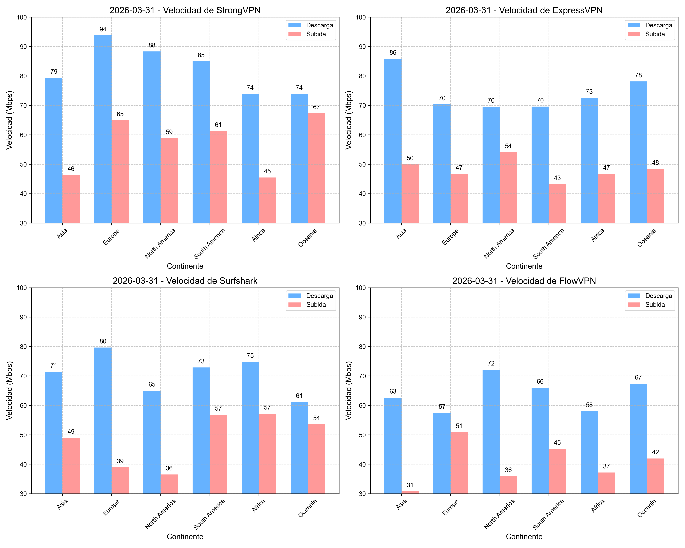
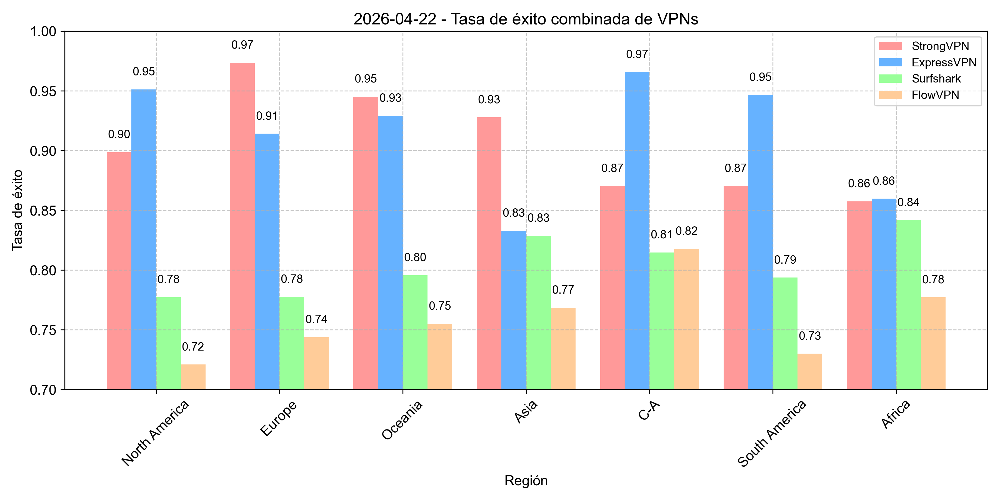
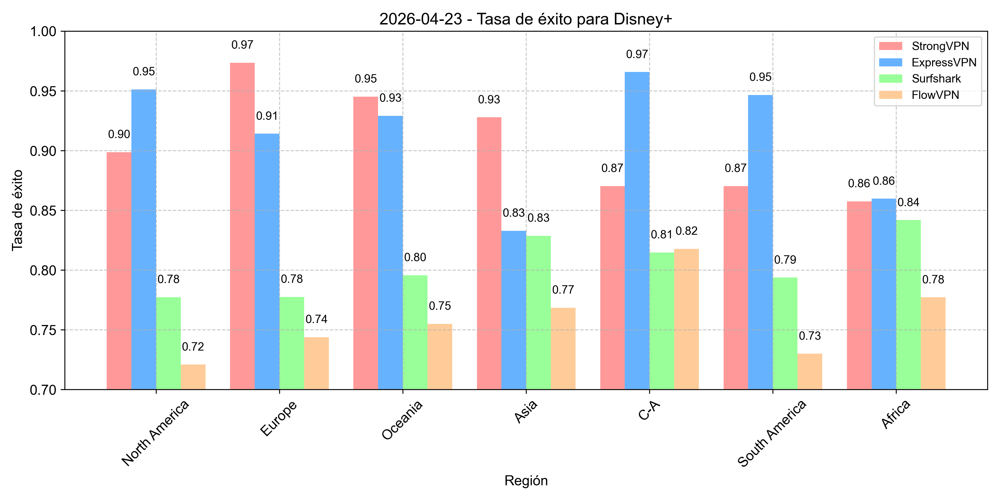

# Recomendación de VPNs globales - Actualización diaria de velocidad (Última actualización: 16/01/2026) - Universo VPN

**Última actualización: 16/01/2026**

<!-- 
 -->

## Si te gusta este artículo, ¡dale una estrella en la esquina superior derecha y síguenos! Juntos, construyamos un mundo más libre y conectado.

### Conclusión directa sobre precio y calidad - Comparación de VPNs

### Características y diferencias de las cuatro VPNs recomendadas, con las mejores ofertas

| VPN Recomendada | Mejor oferta (duración) | Precio mensual (USD) | Precio total | Características | Pago internacional |
| --------------- | ----------------------- | -------------------- | ------------ | --------------- | ------------------ |
| [StrongVPN](https://strongvpn.com/jp/?tr_aid=60d96b5810e50&chan=w_github_es&data1=fanqiang&data2=title) | Compra 1 año | 4.5 | 54 | Mejor relación calidad-precio | Sí |
| [FlowVPN (prueba gratuita de 2 días)](https://www.flowvpx.com/sign-up/?locale=ja-jp&special=FREETRIAL&r=35-890485.w_github) | Compra 1 año | 4.17 | 50 | Prueba gratuita de 2 días | Sí |
| [ExpressVPN (compra 12 meses + 3 meses gratis)](https://go.expressvpn.com/c/3828265/1509296/16063) | Compra 1 año (15 meses total) | 5.33 | 6.67 x 12 = 80 | Máxima estabilidad y velocidad | No |
| [Surfshark](https://get.surfshark.net/aff_c?offer_id=323&aff_id=5585&source=w_github&aff_sub=streaming) | Compra 2 años | 2.30 | 55 | Dispositivos ilimitados | No |

### Gráfico comparativo de precios de VPNs - Estrategia para comprar al mejor precio

- Si planeas comprar por 1 año y no necesitas alta velocidad, te recomendamos [StrongVPN](https://strongvpn.com/jp/?tr_aid=60d96b5810e50&chan=w_github_es&data1=fanqiang&data2=title) por solo 43 USD (usa un nuevo email cada año con nuestro enlace de descuento), unos 4 USD al mes.
- Si planeas comprar por 2 años y no necesitas alta velocidad, te recomendamos [Surfshark](https://get.surfshark.net/aff_c?offer_id=323&aff_id=5585&source=w_github&aff_sub=streaming) por solo 55 USD (usa un nuevo email cada año con nuestro enlace de descuento).
- Si planeas comprar por 1 año y buscas alta velocidad, te sugerimos [ExpressVPN (12 meses + 3 gratis)](https://go.expressvpn.com/c/3828265/1509296/16063) (usa un nuevo email cada año con nuestro enlace de descuento), unos 6 USD al mes.
- Si solo necesitas leer papers y no exiges mucha velocidad, considera [FlowVPN](https://www.flowvpx.com/sign-up/?locale=ja-jp&special=FREETRIAL&r=35-890485.w_github).

Tras investigar y realizar múltiples pruebas, he recopilado datos de velocidad de VPNs en diferentes regiones, creando el siguiente gráfico para tu referencia. ExpressVPN lidera en estabilidad, seguido por StrongVPN, mientras que Surfshark y FlowVPN son similares. Depende de tu estrategia de compra. Aquí presento los resultados promedio de nuestras pruebas en regiones comunes, con barras de error para reflejar la variabilidad.

#### Gráfico de pruebas de velocidad de VPN, incluyendo subida y bajada.

Realizamos actualizaciones diarias y promediamos los datos de los últimos **7 días, 14 días, 30 días y 90 días**, con al menos 10-20 conexiones diarias. Detalles de nuestro equipo están al final del artículo. Las líneas horizontales representan la desviación estándar.

- **Resultados de pruebas de velocidad de VPN (últimos 7, 14, 30 y 90 días)**  
  

| Servicio VPN | WireGuard/Protocolo propietario | OpenVPN |
| ------------ | ------------------------------ | ------- |
| ExpressVPN   | 600 Mbps                      | 400 Mbps |
| FlowVPN      | 650 Mbps                      | 380 Mbps |
| StrongVPN    | 500 Mbps                      | 350 Mbps |
| Surfshark    | 800 Mbps                      | 300 Mbps |

- **Recomendaciones basadas en precio y velocidad**:
  - Si planeas comprar por 1 año y no necesitas alta velocidad, te recomendamos [StrongVPN](https://strongvpn.com/jp/?tr_aid=60d96b5810e50&chan=w_github_es&data1=fanqiang&data2=title) por 43 USD (usa un nuevo email con nuestro enlace), unos 4 USD al mes.
  - Si planeas comprar por 1 año y buscas alta velocidad, te sugerimos [ExpressVPN (12 meses + 3 gratis)](https://go.expressvpn.com/c/3828265/1509296/16063) (usa un nuevo email con nuestro enlace), unos 6 USD al mes.

La velocidad de conexión es clave para los usuarios de VPN. Si tu VPN ralentiza tu internet, es poco probable que la uses con frecuencia, dejando tus dispositivos expuestos. Hoy, una de las principales funciones de las VPNs es el streaming, donde cargar contenido en HD y 4K sin buffering es esencial. En nuestras pruebas, usamos una línea de 1 Gbps para evaluar cada servicio con herramientas como Ookla SpeedTest, nPerf, Netflix Fast y CLI. Tomamos el promedio (mediana) de cada herramienta para un rango de velocidad preciso, repitiendo las pruebas por la mañana y tarde para mayor precisión.

> ## Navegación de contenido del artículo
> ### 1. [Conocimientos básicos de navegación libre](#conocimientos-básicos-de-navegación-libre)
> ### 2. [Resumen de funciones recomendadas de VPNs globales](#resumen-de-funciones-recomendadas-de-vpns-globales)
> #### 2.1 [Recomendación de StrongVPN](#recomendacion-de-strongvpn)
> #### 2.2 [ExpressVPN - 12 meses + 3 meses gratis](#expressvpn-12-meses-+-3-meses-gratis)
> #### 2.3 [Recomendación de Surfshark - Conexiones ilimitadas](#recomendacion-de-surfshark-conexiones-ilimitadas)
> #### 2.4 [FlowVPN - Prueba gratuita de dos días](#flowvpn-prueba-gratuita-de-dos-dias)
> #### 2.5 [Análisis y comparación de políticas de privacidad de proveedores de VPN](#analisis-y-comparacion-de-politicas-de-privacidad-de-proveedores-de-vpn)
> ### 3. [StrongVPN - Tutorial paso a paso con pagos internacionales](#tutorial-de-compra-con-pagos-internacionales-para-strongvpn)
> #### 3.1 [Tutorial de configuración de StrongVPN en dispositivos móviles (Android/iOS)](#tutorial-de-configuracion-de-strongvpn-en-androidios)
> ### 4. [Tutorial de compra con oferta de ExpressVPN](#tutorial-de-compra-con-oferta-de-expressvpn)
> #### 4.1 [Tutorial de configuración de ExpressVPN en PC, móvil y tablet](#tutorial-de-configuracion-de-expressvpn-en-pc-movil-y-tablet)
> ### 5. [Surfshark - Tutorial paso a paso para comprar](#tutorial-de-compra-de-surfshark)
> ### 6. [FlowVPN - Tutorial paso a paso para la prueba gratuita de dos días](#tutorial-de-compra-y-prueba-gratuita-de-flowvpn)
> ### 7. [Lista de VPNs no recomendadas](#lista-de-vpns-no-recomendadas)
> ### 8. [Estándares de recomendación de VPNs y características esenciales](#estandares-de-recomendacion-de-vpns-y-caracteristicas-esenciales)
> ### 9. [Conocimientos esenciales sobre VPN que debes saber](#conocimientos-esenciales-sobre-vpn-que-debes-saber)
> #### 9.1 [Uso y ventajas de VPNs dobles o múltiples](#uso-y-ventajas-de-vpns-dobles-o-multiples)
> #### 9.2 [Impacto de las VPNs en la velocidad de red](#impacto-de-las-vpns-en-la-velocidad-de-red)
> #### 9.3 [Diferencias entre software de acceso y VPNs](#diferencias-entre-software-de-acceso-y-vpns)
> #### 9.4 [Cómo cambiar tu VPN regularmente para mayor seguridad](#como-cambiar-tu-vpn-regularmente-para-mayor-seguridad)
> ### 10. [Introducción a la criptografía básica y principios de VPN](#introduccion-a-la-criptografia-basica-y-principios-de-vpn)
> ### 11. [Qué puedes hacer con una VPN y precauciones](#que-puedes-hacer-con-una-vpn-y-precauciones)
> ### 12. [Introducción a los protocolos comunes de VPN](#introduccion-a-los-protocolos-comunes-de-vpn)
> #### 12.1 [Diferencias y escenarios de uso entre VPN y Tor](#diferencias-y-escenarios-de-uso-entre-vpn-y-tor)
> #### 12.2 [Diferencias entre VPN y servidores proxy](#diferencias-entre-vpn-y-servidores-proxy)
> ### 13. [Análisis de servidores VPN - Consejos prácticos](#analisis-de-servidores-vpn-consejos-practicos)
> #### 13.1 [Cómo solucionar interrupciones de conexión VPN](#como-solucionar-interrupciones-de-conexion-vpn)
> #### 13.2 [Cómo asegurar que tu VPN permanezca activa y funcional](#como-asegurar-que-tu-vpn-permaneca-activa-y-funcional)
> ### 14. [Riesgos de las VPNs gratuitas - ¿Por qué no recomendarlas?](#riesgos-de-las-vpns-gratuitas-por-que-no-recomendarlas)
> ### 15. [¿Por qué no recomendar construir tu propia VPN?](#por-que-no-recomendar-construir-tu-propia-vpn)
> ### 16. [Características de VPN para juegos](#caracteristicas-de-vpn-para-juegos)
> ### 17. [Guía para ver contenido de streaming con VPN](#guia-para-ver-contenido-de-streaming-con-vpn)
> #### 17.1 [Cómo detectan y bloquean Netflix y Hulu las conexiones VPN](#como-detectan-y-bloquean-netflix-y-hulu-las-conexiones-vpn)
> ### 18. [Informe detallado de pruebas de velocidad de VPN](#informe-detallado-de-pruebas-de-velocidad-de-vpn)
> #### 18.1 [Tasa de éxito de conexión de VPN en continentes](#tasa-de-exito-de-conexion-de-vpn-en-continentes)
> #### 18.2 [Pruebas de velocidad de VPN en regiones globales](#pruebas-de-velocidad-de-vpn-en-regiones-globales)
> #### 18.3 [Tasa de éxito de VPN para conectar Netflix en continentes](#tasa-de-exito-de-vpn-para-conectar-netflix-en-continentes)
> #### 18.4 [Tasa de éxito de VPN para conectar Disney+ en continentes](#tasa-de-exito-de-vpn-para-conectar-disney-en-continentes)
> ### 19. [Tutorial de instalación de VPN en Linux](#tutorial-de-instalacion-de-vpn-en-linux)
> ### 20. [Aplicaciones y servicios que pueden bloquear VPNs](#aplicaciones-y-servicios-que-pueden-bloquear-vpns)
> ### 21. [Configuración y consejos para BitTorrent con VPN](#configuracion-y-consejos-para-bittorrent-con-vpn)
> ### 22. [VPN para Apple TV](#vpn-para-apple-tv)
> ### 23. [Tendencias y predicciones futuras de VPN](#tendencias-y-predicciones-futuras-de-vpn)
> #### 23.1 [Limitaciones de VPN y soluciones](#limitaciones-de-vpn-y-soluciones)

**Última actualización: 16/01/2026**

>**En el entorno actual, las VPNs que ofrecen conexión estable y efectiva a nivel global son cada vez más raras. Muchos sitios de reseñas copian contenido entre sí, perdiendo relevancia con el tiempo. Algunas VPNs recomendadas no funcionan bien en ciertas regiones, y lamentablemente, muchos revisores están fuera de estas áreas, sin experiencia real local. En los últimos años, las restricciones de red han afectado a varios servicios, haciendo que VPNs previamente funcionales sean casi inútiles. Te invito a leer este artículo con precaución para evitar caer en trampas. Este artículo, basado en mi experiencia real, actualiza continuamente el estado de las VPNs, ayudándote a elegir herramientas seguras para streaming, gaming y privacidad. Si buscas una solución rápida, consulta la navegación al final.**

La importancia de superar restricciones para navegar libremente es evidente. Sin ello, no podrías usar Google para buscar código, responder correos de Gmail, ver videos de YouTube, disfrutar cursos de Udemy, seguir series de HBO o Netflix, ni acceder a noticias como BBC y CNN. Como alguien que viaja por trabajo y estudia, uso estas herramientas en diferentes regiones. Como programador y doctor en machine learning con experiencia en redes, te guiaré con detalles sobre VPNs, seguridad y tecnologías como WireGuard y V2Ray, además de compartir mis pruebas de velocidad para recomendar las opciones más estables y seguras.

>**Según reportes globales, el número de usuarios en línea ha crecido enormemente, con más de 900 millones de personas conectadas, destacando la necesidad de acceso libre. Muchos blogs recomiendan VPNs sin verificar, promoviendo servicios ineficaces o incluso peligrosos. Algunos sitios engañan con palabras vacías, y con las actualizaciones de red cada vez más estrictas, muchas VPNs han dejado de funcionar. He creado este blog en GitHub para guiarte, ayudándote a evitar trampas y perder tiempo con VPNs riesgosas o inútiles. Este artículo incluye detalles técnicos; si solo quieres una recomendación rápida, ve a la sección de sugerencias al final.**

Años de experiencia trabajando entre diferentes países me han enseñado que superar restricciones es una habilidad esencial hoy. Sin ello, no puedes aprender con Google, ver YouTube, contactar amigos en Facebook o Line, disfrutar cursos de Coursera y Udemy, ni acceder a entretenimiento como HBO, Netflix, BBC o CNN. Como profesional que viaja y un doctor en machine learning especializado en redes, te ofreceré una guía detallada sobre VPNs, seguridad y tecnologías como WireGuard, V2Ray y más, basada en mis pruebas y experiencia para recomendar las mejores herramientas estables y seguras.

## Noticias recientes de VPNs
La última actualización de seguridad de Microsoft en junio de 2024 pudo haber causado problemas de conexión VPN para usuarios de Windows 11, 10 y Server 2008 o superior. Algunos usuarios en Reddit reportaron fallos tras la actualización, resueltos temporalmente reinstalando la app. Microsoft ha confirmado el inconveniente y planea una corrección futura.  
<!-- [Ver contenido completo en el enlace original](https://tw.news.yahoo.com/microsofts-latest-windows-security-updates-might-break-your-vpn-001216447.html) -->

## Actualización del estado de VPNs
Desde la temporada navideña de 2021 hasta mayo de 2023, hemos visto cambios significativos en el mundo de las VPNs. Servicios como Ivacy, VyprVPN y otros han enfrentado desafíos en varias regiones, con servidores frecuentemente bloqueados. Su seguridad ha quedado expuesta, como un insecto bajo la luz. Te advertimos evitar estos riesgos. Incluso gigantes como NordVPN han sido golpeados, requiriendo configuraciones manuales, mientras que PIA, una vez un "pequeño estrella", ha perdido brillo y sigue desconectada en muchas áreas.

PandaVPN, como un niño perdido, dejó de responder desde noviembre, con su sitio inaccesible y líneas muertas, sugiriendo un posible abandono. Muchos servicios han tomado caminos similares, así que mantente alerta.

Sin embargo, como la Estrella Polar, **ExpressVPN y StrongVPN** han mantenido estabilidad, como escuchar las olas en la playa. ExpressVPN es como un cuchillo suizo, compatible con todas las plataformas, y se recupera de interrupciones en una semana con actualizaciones. StrongVPN, nuestro "soldado ligero", ofrece precios accesibles con clientes universales y simplificados para Windows, Mac y Android. Sus servidores se actualizan regularmente, con menos bloqueos. Para iPhone, podrías necesitar soporte para configuraciones manuales. En tiempos sensibles, el soporte puede ofrecer líneas alternativas.

Este sitio incluye guías, pruebas de velocidad y soluciones a problemas comunes. Te sugiero usar la navegación al final para ir directamente a la sección que necesitas.

## Conocimientos básicos de navegación libre

### ¿Qué es la navegación libre?

Primero, exploremos los fundamentos de las restricciones de red.

#### Conceptos básicos de las restricciones de red (¿Qué son?)

Las políticas de control de red son medidas globales diseñadas para proteger empresas e infraestructuras contra ataques cibernéticos. Supervisadas por autoridades, estas políticas limitan el acceso a ciertos sitios. Ejemplos de sitios bloqueados incluyen Facebook, YouTube, Instagram, Vimeo, Spotify, Snapchat y Tumblr, además de medios como The New York Times, CNN, Reuters y The Wall Street Journal.  
Estos sitios suelen mostrar errores técnicos (como código 404, conexión reiniciada o tiempo de espera agotado) debido a técnicas como envenenamiento DNS, bloqueo de IP, filtrado de URL, inspección de paquetes y reinicio de conexiones. En algunos casos, se monitorean palabras clave para rastrear actividades.

#### ¿Por qué superar restricciones?

La razón es simple: sin una VPN, trabajar remotamente se complica, ya que apps como Slack, Microsoft OneDrive y Dropbox están restringidas. El paquete completo de Google (incluyendo Gmail y Google Drive) también es inaccesible. Redes sociales como Facebook, YouTube, Instagram, Vimeo, Spotify, Snapchat y Tumblr dificultan la comunicación con amigos y familia.  
La mayoría de los sitios de noticias occidentales, como The New York Times, CNN, Reuters y Financial Times, también están bloqueados, y esta lista cambia constantemente.

#### Origen de la navegación libre
¿Cómo ayuda la tecnología VPN a evitar la censura en internet?

Una red privada virtual (VPN) te permite superar restricciones al engañar a tu proveedor de internet (ISP), haciéndole creer que estás fuera de tu región. Aunque usar VPNs en algunos lugares es técnicamente ilegal, las acciones legales contra turistas o profesionales son raras.  
Descargar una VPN antes de viajar es clave, ya que muchos sitios VPN están restringidos. Recomendamos proveedores probados como ExpressVPN o StrongVPN, que demuestran consistencia en superar barreras. Para evitar detección, se usan términos como "navegación libre" o "herramientas de acceso".

En resumen, el proceso de usar herramientas específicas para acceder a sitios internacionales se conoce como "navegación libre", y estas herramientas se llaman VPNs o software de acceso.

#### Otros beneficios de una VPN: ¿Por qué ocultar tu IP?
Tu dirección IP es como una dirección postal, identificando tu ubicación de forma única. Sin embargo, también puede ser una desventaja, ya que terceros podrían usarla para monitorear tus actividades. Una VPN intercambia tu IP por la de un servidor, encriptando tu conexión e ocultando tu identidad en segundos. Esta red privada y segura agrupa tu tráfico, protegiéndolo de terceros.

#### Otro beneficio de VPN: Riesgos de usar Wi-Fi público
Ya sea en cafeterías, aeropuertos o hoteles, el Wi-Fi público ofrece conveniencia, pero conlleva riesgos: expone tus datos a hackers. Sin una VPN, usar estas redes te hace vulnerable a intrusos que pueden acceder a tu información personal, como datos bancarios, comunicaciones laborales, números de teléfono, correos y mensajes, sin tu permiso. Con una VPN, navega tranquilo en hotspots.

### Protocolos comunes de software de navegación libre
A continuación, algunos términos técnicos relacionados con la navegación libre. Conocerlos te ayudará a elegir mejor y entender las categorías más detalladas de la industria.

**VPN**  
Los usuarios familiarizados con superar restricciones probablemente hayan oído hablar de VPN. Es una estrategia de encriptación que protege tu IP, ubicación y datos personales. Puede verse como un disfraz (aunque la encriptación es lo esencial), permitiendo acceder a contenido restringido.  
Aunque muchos usan VPNs por seguridad (como teletrabajadores durante la pandemia), los métodos tradicionales han perdido eficacia contra restricciones avanzadas, requiriendo soluciones más robustas.

## Resumen de funciones recomendadas de VPNs globales 

Tras probar cientos de VPNs, te presento las mejores opciones basadas en mi experiencia trabajando en comercio internacional. Consulta el informe de velocidad más abajo para comparaciones detalladas. Como profesional que viaja y experto en redes, te recomiendo un buen servicio con estas características:

- Alta seguridad (proveedores no locales, preferiblemente fuera de regiones restringidas).
- Conexión estable.
- Máxima velocidad posible.
- Más nodos (acceso a múltiples países).
- Fácil de usar (conexión con un clic).
- Funciones avanzadas de encriptación y privacidad.
- Soporte para múltiples dispositivos simultáneos.
- Alta compatibilidad (Windows, Linux, Android, etc.).
- Atención al cliente 24/7 en varios idiomas.
- Garantía de reembolso de 30 días.
- Variedad de métodos de pago.
- Precio justo y buena relación calidad-precio.

### 1. [StrongVPN – La mejor relación calidad-precio](https://strongvpn.com/jp/?tr_aid=60d96b5810e50&chan=w_github_es&data1=fanqiang&data2=title)
### Recomendación de StrongVPN

**StrongVPN** es una VPN emergente de Europa y América con precios mucho más bajos que gigantes como ExpressVPN, desde 3.5 USD al mes (plan de 12 meses, total 43.99 USD). A diferencia de ExpressVPN, soporta pagos internacionales, y su equipo de ingenieros actualiza nodos regularmente. Ideal para ver YouTube, Facebook o disfrutar de Netflix, Hulu, ABC, HBO y Sky Go.  
Ofrece apps para Windows, Mac, iOS, Android y Amazon Fire TV, además de guías para Chrome, routers, Fire TV y Kodi. Con más de 950 servidores P2P en 35 países y 46 ciudades, soporta protocolos como L2TP, SSTP, OpenVPN, IKEv2 y WireGuard. Incluye soporte 24/7 por chat y email, y una garantía de reembolso de 30 días. Sin lujos, pero suficiente para la mayoría.

**StrongVPN** diseña una red global con más de 950 servidores, cubriendo 30+ países y 46 ciudades, con 59,500 IPs VPN. Garantiza privacidad con una política de cero logs, controlando el acceso a tus datos y evitando venderlos a terceros. Solo busca mantenerte seguro.

#### ¿Qué tan rápida es StrongVPN?
La velocidad de conexión es tan importante como la privacidad. Probamos StrongVPN en líneas de 1 Gbps (EE. UU. y Reino Unido) con sitios como SpeedTest, SpeedOf.me y nPerf. Con OpenVPN, alcanzamos 230-240 Mbps en EE. UU., útil para streaming. Con IKEv2, llegamos a 260-280 Mbps, casi al nivel de ExpressVPN. Con WireGuard, obtuvimos 270-300 Mbps en EE. UU. y hasta 450 Mbps en Reino Unido. En pruebas anteriores, superamos 600 Mbps, así que tu velocidad local puede ser mayor. Comparado con los más rápidos (hasta 800 Mbps), la diferencia es mínima en líneas de 100 Mbps.

**12 conexiones simultáneas**: Usa StrongVPN en hasta 12 dispositivos a la vez.

### Características de StrongVPN

- Soporte amplio: Apps para iOS, Android, macOS, Windows.
- Hasta 12 conexiones simultáneas.
- Desbloquea Netflix, Amazon Prime Video, Disney+.
- 250 GB de almacenamiento SugarSync (plan anual).
- Más de 8000 servidores.
- Protocolos: L2TP, SSTP, OpenVPN, IKEv2, WireGuard.
- Reembolso de 30 días si lo solicitas.
- Soporte técnico 24/7 por expertos.
- Política de privacidad: No rastrea ni almacena datos.
- Precio más bajo que ExpressVPN o Surfshark.
- Soporte para pagos internacionales (tarjetas, PayPal).
- Alta estabilidad.

| Función/Especificación | StrongVPN |
| :--------------------: | :-------: |
| Plataformas cliente    | Windows, Mac, Linux, Android, iOS, DDWRT, macOS, GLiNet routers, Android TV |
| Protocolos soportados  | OpenVPN, L2TP/IPsec, SSTP, WireGuard |
| Número de servidores   | 950+ |
| Número de países       | 35+ |
| País de registro       | EE. UU. |
| Métodos de pago        | Tarjetas, PayPal, pagos internacionales |
| ¿Requiere identificación? | No |
| Protocolos de encriptación | WireGuard, OpenVPN, IKEv2, L2TP, SSTP |
| Uso de datos           | Ancho de banda ilimitado |
| Uso                     | Ilimitado |
| Dispositivos conectados simultáneamente | 12 |
| Soporte al cliente      | Email, chat en vivo, teléfono |
| Política de privacidad | Sin registros |

### 2. [ExpressVPN - 12 meses + 3 meses gratis](https://go.expressvpn.com/c/3828265/1509296/16063)
### ExpressVPN - 12 meses + 3 meses gratis

## Resumen de características recomendadas de VPNs globales 

### ExpressVPN - Características
VPN市场充满竞争，pero **ExpressVPN** destaca por sus funciones profesionales y una oferta más completa que la mayoría.  
Ofrece soporte de primera para Windows, Mac, Android, iOS, Linux y más, incluyendo guías detalladas para routers, Apple TV, Fire TV, PlayStation, Chromebook y Kindle. Sus funciones principales incluyen protección multilínea: usa sus propios servidores DNS para resguardar tu tráfico. Su encriptación de alto nivel protege contra ataques avanzados, y un interruptor de apagado de calidad se activa si la VPN falla, asegurando tu seguridad.

Con una red de más de 3,000 servidores en 94 países y 160 ciudades, la cobertura es sobresaliente, especialmente en Europa y EE. UU., pero también en Asia con 27 países, superando a competidores como Mozilla VPN (30 países totales). Como la mayor VPN global, ExpressVPN actualiza rápidamente con recursos propios, desbloquea Netflix, soporta descargas P2P y mantiene una política de cero logs. Su tasa de éxito en conexiones estables es de las más altas, ideal para streaming y gaming. El único inconveniente es su precio algo elevado.

La protección de privacidad de ExpressVPN usa encriptación industrial. El intercambio de claves Diffie-Helman asegura conexiones seguras con servidores remotos, AES-256-GCM protege tus datos de atacantes avanzados, y la autenticación HMAC evita alteraciones en tiempo real. Su soporte DNS es un plus: evita fugas con servidores privados de cero conocimiento y 256-bit encriptación, superando a proveedores menores que redirigen a terceros como OpenDNS.

#### Características de ExpressVPN
- Hasta 160 ubicaciones en 94 países/regiones.
- Amplia base de usuarios.
- Actualización rápida de servidores al encender.
- Garantía de reembolso de 30 días.
- **Soporte 24/7**.
- Apps para Windows, Mac, Android, iOS, Linux y más.
- Incluye Apple TV, Fire TV, PlayStation, Chromebook, Kindle.
- Pagos en varias monedas, incluyendo Bitcoin.
- Encriptación industrial.

Ahorra dinero con nuestra oferta exclusiva: regístrate y obtén 3 meses gratis con una suscripción anual de ExpressVPN (15 meses totales por 6.67 USD/mes). Ofrecen pagos variados como tarjetas, PayPal, Bitcoin y más.  
**Instala la app en Android o iOS para una prueba de 7 días, y con la garantía de 30 días, puedes probar sin riesgos.** Cancelar es fácil: no necesitas justificar tu decisión, usa los 30 días y, si no estás satisfecho, solicita tu reembolso sin preocupaciones.

| Característica | ExpressVPN |
| -------------- | ---------- |
| Número de servidores | 3000+ |
| Número de países | 94 |
| Plataformas soportadas | Windows, Mac, iOS, Android, Linux, BlackBerry, Kindle Fire, Nook, routers, consolas (MediaStreamer), Amazon Fire TV Stick, Apple TV, Boxee, Chromebook, Windows Phone |
| Número de conexiones simultáneas | 5 |
| Tecnología de división de túnel | Sí |
| Tecnología de interruptor de apagado | Sí |
| Protocolos soportados | Lightway, OpenVPN UDP, OpenVPN TCP, L2TP/IPSec, IKEv2 |
| País de registro | Islas Vírgenes Británicas |
| Soporte | Chat en vivo 24/7, email, base de conocimientos |

### 3. [Surfshark - Conexiones ilimitadas](https://get.surfshark.net/aff_c?offer_id=323&aff_id=5585&source=w_github&aff_sub=streaming)
### Recomendación de Surfshark VPN

**Surfshark** es una VPN sofisticada y potente que compite con los mejores proveedores a un precio irresistible. Aunque su interruptor de apagado tiene pequeños fallos y OpenVPN no es el más rápido, por este costo no encontrarás mejor opción. Fundada en 2018, esta nueva estrella ha ganado popularidad, rivalizando con los gigantes y posicionándose como una de las mejores VPNs del mercado.  
Con más de 3,200 servidores en 65 países y 160 ubicaciones, funciona casi en cualquier lugar. Ofrece apps para Windows, Mac, iOS, Android, Linux, y extensiones para Chrome, Firefox y Edge, además de un sistema de DNS inteligente para consolas y smart TVs.

Usa encriptación AES-256-GCM, soporta WireGuard, OpenVPN e IKEv2, con una política de cero logs y un interruptor de apagado que protege tu dispositivo si la conexión falla. Basada en las Islas Vírgenes Británicas como ExpressVPN, no requiere guardar logs de usuario. Solo almacena tu email y datos de facturación.

Desbloquea Netflix en cerca de 20 países (EE. UU., Francia, Japón, Italia, Australia, etc.), y también soporta Amazon Prime y Disney+. Perfecto para streaming y gaming.

#### Características de Surfshark VPN
- Oferta introductoria súper barata.
- Auditorías de seguridad recientes para tranquilidad.
- Excelente rendimiento en streaming.
- Pagos con tarjetas, PayPal, criptomonedas, Amazon Pay y Google Pay.
- Soporte al cliente muy útil.
- Más de 3,200 servidores en 65 ubicaciones con conexiones ilimitadas y encriptación AES-256-GCM.
- **Conexiones ilimitadas a dispositivos**.
- Garantía de reembolso de 30 días.
- Precio más bajo visto: 2.30 USD/mes en el plan de 2 años.
- Surfshark Nexus introducirá en 2022-2023 nuevas funciones como IP Rotator, que cambia tu IP automáticamente cada pocos minutos sin desconexión.

## Resumen de características recomendadas de VPNs globales

### 4. [FlowVPN - Prueba gratuita de dos días](https://www.flowvpx.com/sign-up/?locale=ja-jp&special=FREETRIAL&r=35-890485.w_github)
### Recomendación de FlowVPN - Prueba gratuita de dos días

### Características de FlowVPN (prueba gratuita de dos días)

- **Increíble prueba gratuita de dos días**, perfecta para explorar.
- Económico y práctico, ideal para estudiantes.
- Estabilidad y velocidad competitivas con proveedores europeos y americanos, consulta la foto de velocidad arriba.
- Soporte para pagos internacionales y atención al cliente en varios idiomas.
- Protocolos soportados: IPSec IKEv1, IPSec IKEv2, WireGuard, OpenVPN, L2TP y PPTP.
- Protocolos personalizados SSL y FlowTCP.
- Más de 100 servidores en 60+ países, incluyendo Reino Unido, EE. UU., Australia y más.
- Compatible con Mac, iPad, iPhone, Android y Windows.
- Uso simultáneo en hasta 4 dispositivos.
- Descuentos especiales para estudiantes y personal educativo.

### Análisis y comparación de políticas de privacidad de proveedores de VPN

Al elegir un proveedor de VPN, la política de privacidad es un factor clave que afecta la seguridad de tus datos. Aquí comparamos las políticas de ExpressVPN, StrongVPN y Surfshark.

#### ExpressVPN
ExpressVPN, con sede en las Islas Vírgenes Británicas, se compromete fuertemente con la privacidad, evitando leyes estrictas de retención de datos. Su estricta política de cero logs asegura que no registra tus actividades ni tu IP al conectarte.

#### StrongVPN
StrongVPN, basado en EE. UU., también promete no registrar tus actividades. Sin embargo, las leyes de retención de datos en EE. UU. podrían influir, aunque asegura no compartir datos con terceros salvo por requerimientos legales.

#### Surfshark
Surfshark, también en las Islas Vírgenes Británicas como ExpressVPN, promete no registrar actividades. Su política de privacidad es clara, detallando qué datos recopila (solo email y facturación) y su uso, sin compartir con terceros salvo por mandato legal.

| Característica | ExpressVPN | StrongVPN | Surfshark |
| -------------- | ---------- | --------- | --------- |
| Ubicación      | Islas Vírgenes Británicas | EE. UU. | Islas Vírgenes Británicas |
| Registra actividades | No | No | No |
| Comparte datos con terceros | No, salvo legalmente | No, salvo legalmente | No, salvo legalmente |

En resumen, al elegir una VPN, lee detalladamente las políticas de privacidad de cada proveedor para entender cómo protegen tus datos.

## Tutorial paso a paso para comprar StrongVPN con pagos internacionales y configurar ExpressVPN

## StrongVPN - Tutorial paso a paso con pagos internacionales
Una característica destacada de **StrongVPN** es su soporte para pagos internacionales, ideal para quienes prefieren esta opción. También te recomendamos considerar **FlowVPN** si buscas alternativas similares.

### Paso 1: Accede a nuestra oferta exclusiva
Visita nuestro enlace exclusivo [StrongVPN](https://strongvpn.com/jp/?tr_aid=60d96b5810e50&chan=w_github_es&data1=fanqiang&data2=title) y haz clic en "Start Now" (ver imagen abajo).  

### Paso 2: Soluciona problemas de conexión
Si al abrir no puedes comprar porque usas otra VPN, regístrate en [FlowVPN](https://www.flowvpx.com/sign-up/?locale=ja-jp&special=FREETRIAL&r=35-890485.w_github) (consulta el tutorial de instalación más abajo). FlowVPN ofrece una prueba gratuita de dos días, perfecta para comprar StrongVPN.  

Tras registrarte en FlowVPN, selecciona Reino Unido. El plan de 1 año cuesta solo 43 USD (nota: válido por 12 meses; para renovar, usa un nuevo email con nuestro enlace de descuento).  

### Paso 3: Elige tu método de pago
Desplázate hacia abajo y selecciona pagos internacionales, tarjetas de banco (incluyendo Visa o MasterCard, también acepta tarjetas extranjeras), o PayPal.  

### Tutorial de configuración de StrongVPN en dispositivos móviles (Android/iOS)

Ya seas usuario de Android o iOS, sigue estos pasos para configurar StrongVPN en tu móvil:

#### 1. Compra y registra StrongVPN
Visita [StrongVPN](https://strongvpn.com/jp/?tr_aid=60d96b5810e50&chan=w_github_es&data1=fanqiang&data2=title), elige un plan y crea una cuenta.

#### 2. Instalación y configuración en Android
- Abre Google Play Store, busca "StrongVPN".
- Toca "Instalar" para descargar e instalar la app.
- Abre la app, ingresa tu usuario y contraseña, y haz clic en "Iniciar sesión".
- Selecciona "Mejor ubicación disponible" para conectar automáticamente o "Elegir ubicación" para un servidor manual.

#### 3. Instalación y configuración en iOS
- Abre App Store, busca "StrongVPN".
- Toca "Obtener" para descargar e instalar la app.
- Abre la app, ingresa tu usuario y contraseña, y haz clic en "Iniciar sesión".
- Selecciona "Mejor ubicación disponible" para conectar automáticamente o "Elegir ubicación" para un servidor manual.

¡Disfruta de una experiencia segura, privada y sin obstáculos en tu móvil!

## Tutorial de compra con oferta de ExpressVPN
Nota: **ExpressVPN** no soporta pagos internacionales directamente, pero te recomendamos **StrongVPN** o **FlowVPN** si prefieres esa opción. ExpressVPN acepta tarjetas de banco (Visa, MasterCard, incluidas extranjeras), Bitcoin y PayPal. Como es un sitio internacional, podrías necesitar una conexión estable.

### Paso 1: Accede al enlace de oferta
Visita nuestro enlace exclusivo [ExpressVPN Oferta](https://go.expressvpn.com/c/3828265/1509296/16063) y haz clic en "Get ExpressVPN" (ver recuadro rojo en la imagen).  

| Duración de suscripción | Costo total | Costo mensual |
| ----------------------- | ----------- | ------------- |
| 1 mes                   | $12.95      | $12.95        |
| 6 meses                 | $59.95      | $9.99         |
| 12 meses                | $99.95      | $8.32 ($6.67 con [oferta de 3 meses gratis](https://go.expressvpn.com/c/3828265/1509296/16063)) |

### Paso 2: Aprovecha la oferta de 12 meses + 3 gratis
Verás un enlace para "compra 12 meses y obtén 3 meses gratis", pagando por 12 meses pero usando 15 meses (nota: válido por 15 meses; para renovar, usa un nuevo email con nuestro enlace de descuento).  

### Paso 3: Ingresa tu email y método de pago
Introduce un email correcto y selecciona tu método de pago (tarjetas de banco, Visa, MasterCard, Bitcoin, PayPal). ¡Asegúrate de no equivocarte o no recibirás el código de verificación!  

### Tutorial de configuración de ExpressVPN en PC, móvil y tablet

Sigue estos pasos simples para configurar ExpressVPN en diferentes dispositivos.

#### 1. Compra y registra ExpressVPN
Visita [ExpressVPN](https://go.expressvpn.com/c/3828265/1509296/16063), elige un plan y crea una cuenta.

#### 2. Instalación y configuración en PC
- Accede al sitio oficial, inicia sesión y descarga la app para tu sistema operativo.
- Abre el instalador y sigue las instrucciones.
- Abre la app, ingresa tu usuario y contraseña, y haz clic en "Iniciar sesión".
- Elige "Ubicación inteligente" para conectar automáticamente o selecciona un servidor manual.

#### 3. Instalación y configuración en móvil
- Visita el sitio oficial desde tu móvil, inicia sesión y descarga la app (o búscala en App Store/Google Play).
- Abre la app, ingresa tu usuario y contraseña, y haz clic en "Iniciar sesión".
- Elige "Ubicación inteligente" para conectar automáticamente o selecciona un servidor manual.

#### 4. Instalación y configuración en tablet
- Visita el sitio oficial desde tu tablet, inicia sesión y descarga la app (o búscala en App Store/Google Play).
- Abre la app, ingresa tu usuario y contraseña, y haz clic en "Iniciar sesión".
- Elige "Ubicación inteligente" para conectar automáticamente o selecciona un servidor manual.

¡Disfruta de una experiencia segura, privada y sin obstáculos en todos tus dispositivos!

## Tutorial paso a paso para comprar Surfshark y FlowVPN

## Surfshark - Tutorial paso a paso para comprar
### Paso 1: Accede a la oferta de Surfshark
Visita nuestro enlace exclusivo [Surfshark - Conexiones ilimitadas](https://get.surfshark.net/aff_c?offer_id=323&aff_id=5585&source=w_github&aff_sub=streaming) y haz clic en "Get" (ver imagen de enseñanza abajo).  

### Paso 2: Aprovecha la oferta de dos años
Verás un enlace para "compra dos años", pagando por 24 meses a menos de 3 USD al mes (nota: válido por 24 meses; para renovar, usa un nuevo email con nuestro enlace de descuento).  

### Paso 3: Ingresa tu email y método de pago
Introduce un email correcto y selecciona tu método de pago (tarjetas de banco como Visa o MasterCard, incluidas extranjeras, Bitcoin, PayPal). ¡Asegúrate de no equivocarte o no recibirás el código de verificación!  

## FlowVPN - Tutorial paso a paso para la prueba gratuita de dos días

### Paso 1: Completa la compra y descarga
Tras comprar con el método anterior, visita [sitio oficial de FlowVPN](https://www.flowvpx.com/download/) para descargar la app compatible con tu dispositivo (Windows, Mac, Android, iOS).

### Paso 2: Instala y comienza a usar
Abre el archivo de instalación, ingresa tu usuario y contraseña, y ¡empieza a disfrutar!

### Paso 1: Regístrate con prueba gratuita
Visita [FlowVPN - Prueba gratuita de dos días](https://www.flowvpx.com/sign-up/?locale=ja-jp&special=FREETRIAL&r=35-890485.w_github) e ingresa tu email y contraseña (¡asegúrate de no equivocarte!).  

### Paso 2: Verificación humana
Selecciona la foto del perro para completar la verificación.  

### Paso 3: Descarga FlowVPN
Puedes descargar la app con soporte para tarjetas de banco (Visa, MasterCard, incluidas extranjeras) y otros métodos internacionales.  

## Problemas de conexión VPN en periodos sensibles y recomendaciones

### FlowVPN - Características (prueba gratuita de dos días)

### 4. [FlowVPN - Prueba gratuita de dos días](https://www.flowvpx.com/sign-up/?locale=ja-jp&special=FREETRIAL&r=35-890485.w_github)
### Recomendación de FlowVPN - Prueba gratuita de dos días

- **Increíble prueba gratuita de dos días**, perfecta para probar.
- Económico y práctico, ideal para estudiantes.
- Estabilidad y velocidad competitivas con proveedores internacionales, consulta la imagen de velocidad arriba.
- Soporte para pagos internacionales y atención al cliente multilingüe.
- Protocolos soportados: IPSec IKEv1, IPSec IKEv2, WireGuard, OpenVPN, L2TP y PPTP.
- Protocolos personalizados SSL y FlowTCP.
- Más de 100 servidores en 60+ países, incluyendo Reino Unido, EE. UU., Australia y más.
- Compatible con Mac, iPad, iPhone, Android y Windows.
- Uso simultáneo en hasta 4 dispositivos.
- Descuentos especiales para estudiantes y personal educativo.

### Análisis y comparación de políticas de privacidad de proveedores de VPN

Al elegir un proveedor de VPN, la política de privacidad es crucial para la seguridad de tus datos. Aquí comparamos ExpressVPN, StrongVPN y Surfshark.

#### ExpressVPN
Con sede en las Islas Vírgenes Británicas, ExpressVPN se compromete a la privacidad, evitando leyes estrictas de retención de datos. Su política de cero logs asegura que no registra tus actividades ni tu IP.

#### StrongVPN
Basado en EE. UU., StrongVPN promete no registrar actividades. Sin embargo, las leyes locales podrían influir, aunque asegura no compartir datos con terceros salvo por requerimientos legales.

#### Surfshark
También en las Islas Vírgenes Británicas, Surfshark promete no registrar actividades. Su política detalla qué datos recopila (solo email y facturación) y su uso, sin compartir con terceros salvo por mandato legal.

| Característica | ExpressVPN | StrongVPN | Surfshark |
| -------------- | ---------- | --------- | --------- |
| Ubicación      | Islas Vírgenes Británicas | EE. UU. | Islas Vírgenes Británicas |
| Registra actividades | No | No | No |
| Comparte datos con terceros | No, salvo legalmente | No, salvo legalmente | No, salvo legalmente |

En resumen, revisa las políticas de privacidad de cada proveedor para entender cómo protegen tus datos.

### Lista de VPNs no recomendadas
Esta tabla incluye VPNs con uso incierto, precios altos o ya inactivas para ayudarte a evitarlas.

| Nombre de VPN | Descripción |
| ------------- | ----------- |
| 360VPN        | Uso incierto |
| Astrill VPN   | Precio elevado |
| CyberGhost    | Precio elevado |
| Elephant VPN  | Uso incierto |
| FlyVPN        | Uso incierto |
| GreenVPN      | Uso incierto |
| Hotspot Shield | VPN gratuita |
| IPVanish VPN  | Precio elevado |
| Kitten VPN    | Uso incierto |
| Kuto VPN      | Uso incierto |
| LetsVPN       | Uso incierto |
| NordVPN       | Inactiva |
| Panda VPN     | Uso incierto |
| PlexVPN       | VPN pequeña |
| Private VPN   | Uso incierto |
| Proton VPN    | Uso incierto |
| PureVPN       | Uso incierto |
| QuickVPN      | Uso incierto |
| Shadowrocket  | Uso incierto |
| SuperVPN      | Uso incierto |
| Testflight VPN | Uso incierto |
| Thunder VPN   | Muy inestable |
| Turbo VPN     | Uso incierto |
| UrbanVPN      | VPN gratuita |
| VPN Proxy Master | Uso incierto |
| VPN Hub       | Uso incierto |
| VyprVPN       | Uso incierto |
| Windscribe    | VPN gratuita |
| Lightyear VPN | Abandonada |
| Princess Connect Accelerator | Uso incierto |
| Aurora VPN    | Uso incierto |
| Sea Gull Network Booster | VPN riesgosa |
| Rocket VPN    | Uso incierto |
| Buddha Jump Wall VPN | Uso incierto |
| Wang VPN      | Casos de sanciones |
| Lantern VPN   | Código abierto |
| Edge VPN      | VPN pequeña |
| Dog Rush VPN  | VPN pequeña |
| Flying Fish VPN | VPN pequeña |
| Black Hole VPN | Uso incierto |
| Ant VPN       | Uso incierto |
| 789VPN        | Uso incierto |
| GodLamp VPN   | Uso incierto |
| Cloud Sail VPN | Uso incierto |
| TenonVPN      | VPN pequeña |
| Summer VPN    | VPN pequeña |

## Estándares de recomendación de VPNs y características esenciales

### Criterios para elegir una VPN
Al seleccionar un servicio VPN, considera estos factores clave:

#### 1. Marcas estables y confiables
Con las restricciones de red cada vez más estrictas, protocolos comunes como PPTP son fácilmente detectados y bloqueados. Una vez que un IP es identificado, suele volverse inutilizable, un problema también presente en servidores propios como SSR.  
Elegir una VPN de una marca grande y estable es crucial. Requiere un respaldo financiero y técnico sólido para adaptarse a actualizaciones de red y mantener la estabilidad a largo plazo.

#### 2. Pruebas y uso personal
Las VPNs recomendadas aquí están entre las 20 principales a nivel global y han sido probadas por mí personalmente. A diferencia de otras reseñas sin verificación o con información obsoleta (como marcas cerradas o inactivas), yo alterno entre varias opciones como respaldo, evitando inconvenientes en regiones con restricciones.

Nuestras recomendaciones se basan en estos criterios. Te sugerimos usar estos estándares, nuestro ranking y mis actualizaciones para elegir, en lugar de pagar sin investigar.

#### 1. Compatibilidad con todos los sistemas operativos
Si usas Windows o macOS, la compatibilidad no suele ser un problema. La mayoría de las VPNs ofrecen apps para Android e iOS. Sin embargo, para Linux o sus variantes como Ubuntu, solo unas pocas como ExpressVPN y StrongVPN ofrecen aplicaciones completas, no solo comandos.

#### 2. Número de dispositivos conectados simultáneamente
ExpressVPN, StrongVPN y FlowVPN permiten hasta 5 conexiones simultáneas, mientras que Surfshark ofrece conexiones ilimitadas. Recuerda que esto es solo para uso simultáneo; puedes instalar estas VPNs en más dispositivos, pero no conectarlas todos a la vez.

#### 3. Técnica de túnel dividido
El túnel dividido (VPN split tunneling) te permite elegir qué apps usan la VPN y cuáles no. Por ejemplo, usa un navegador para ver contenido local como iQiyi sin VPN, y otro para IEEE con VPN, optimizando tu velocidad. Esto mitiga la ralentización típica del encriptado VPN.

#### 4. Ancho de banda (bandwidth)
Un tema a menudo malentendido: el ancho de banda determina cuántos datos puedes transmitir a la vez. Más ancho de banda significa mejor calidad de video. Un VPN con ancho de banda ilimitado asegura que otros usuarios no afecten tu velocidad, a diferencia de límites de datos (por ejemplo, 10 GB diarios para 2-3 películas en HD).

#### 5. Soporte al cliente 24/7
Los VPNs premium como ExpressVPN ofrecen chat en vivo como soporte principal. La mayoría permite comunicación por email, pero StrongVPN y ExpressVPN también tienen chat instantáneo.

#### 6. Garantía de reembolso de 30 días
Si dudas sobre una VPN, la mayoría ofrece una garantía de 30 días, dándote flexibilidad para probar sin riesgos.

## Funciones de privacidad de VPN
### 7. Política de cero logs
Una política de cero logs es esencial para una VPN, asegurando que nunca se registren ni almacenen tus datos. Sin embargo, no hay forma fácil de verificar esto más allá del historial del proveedor. Algunos han sido atrapados vendiendo datos a pesar de promesas, y los listamos abajo para que los evites.

### 8. Variedad de métodos de pago
Incluye tarjetas (MasterCard, Visa), PayPal, y hasta criptomonedas como Bitcoin, ofreciendo flexibilidad global.

### 9. Alta seguridad con sistemas de encriptación modernos
La encriptación usa matemáticas complejas para proteger tus datos con claves seguras. Verás tipos como AES-256 o RSA-4096; cuanto mayor el número, mayor la seguridad.

### 10. Diversos protocolos VPN
Existen varios protocolos (PPTP, OpenVPN, L2TP/IPsec, SSTP), cada uno con ventajas según dispositivo y uso, pero no entraremos en detalles aquí.

### 11. Funciones automáticas de VPN
Las VPNs modernas se conectan automáticamente, evitando accesos no protegidos. Puedes elegir el servidor más cercano o el último usado, aunque no todas ofrecen esta automatización.

### 12. Interruptor de apagado (Kill Switch)
Este interruptor, casi estándar hoy, corta tu internet si la VPN falla, manteniéndote seguro hasta que la conexión se restablezca.

## Análisis de servidores VPN - Consejos prácticos

La distribución de servidores es clave para el rendimiento de una VPN. Más cantidad es bueno, pero su ubicación y cobertura son esenciales. Cuanto más cerca estés de un servidor, mejor será tu velocidad.

### Cómo solucionar interrupciones de conexión VPN

Las interrupciones son comunes al usar una VPN, causadas por red inestable, sobrecarga de servidores o restricciones. Aquí tienes estrategias efectivas:

#### 1. Cambia de servidor VPN
Si el servidor está sobrecargado o tiene mala calidad, prueba con otro. La mayoría de las VPNs ofrecen varias opciones para conexiones más estables.

#### 2. Verifica tu conexión a internet
Si tu red tiene problemas, la VPN no funcionará bien. Reinicia tu router o contacta a tu proveedor.

#### 3. Cambia de protocolo VPN
Prueba protocolos como OpenVPN, PPTP o L2TP/IPsec, que varían en velocidad, seguridad y estabilidad.

#### 4. Usa la función de monitoreo de conexión
Algunas VPNs avanzadas ofrecen "Network Lock" o kill switch, cortando el tráfico si la VPN falla, reiniciándolo al restablecerse.

Identificar la causa es clave; con paciencia, disfrutarás de una VPN sin interrupciones.

### Cómo asegurar que tu VPN permanezca activa y funcional
Mantener tu VPN activa es vital para seguridad y privacidad. Sigue estos consejos:

#### 1. Elige un servicio VPN estable
No todos los proveedores son iguales; investiga para encontrar uno con buena infraestructura y soporte.

#### 2. Activa la función de inicio automático
Configura tu VPN para conectarse al encender el dispositivo, asegurando protección constante.

#### 3. Usa el interruptor de apagado (Kill Switch)
Este corta tu internet si la VPN falla, reiniciándolo al reconectarse.

#### 4. Verifica regularmente la conexión
Aunque algunas apps notifican interrupciones, usa herramientas de terceros para monitorear.

#### 5. Mantén tu equipo y app actualizados
Sistemas o apps desactualizadas afectan el rendimiento; actualiza siempre.

#### 6. Selecciona el protocolo adecuado
Elige un protocolo según tu red (más estable o rápido) para conexiones continuas.

Adapta estas estrategias a tus necesidades para proteger tu privacidad.

### Servidores físicos vs. virtuales
Los servidores físicos son hardware real (más rápidos que software), usados por proveedores para correr VPNs. Son ideales para conexiones rápidas. Los virtuales, simulados en hardware, se usan en ubicaciones donde instalar físicamente no es viable (por prohibiciones o costos, como en algunas regiones). ExpressVPN usa algunos virtuales para acceder a sitios restringidos.

### Servidores multimedia
Optimizados para tareas intensivas como streaming (Netflix, YouTube), estos servidores manejan alto tráfico, ofreciendo mejor conexión y ocultando el uso de VPN para evitar bloqueos.

### Servidores P2P
Redes P2P te permiten descargar archivos directamente de otros usuarios, ideales para torrents. Estos servidores ofrecen ancho de banda extra y seguridad adicional.

## Problemas comunes al usar VPN y soluciones

A continuación, respondo preguntas frecuentes de usuarios, organizadas para tu conveniencia:

### Mi StrongVPN comprado de repente no se conecta, ¿qué hago?
StrongVPN es uno de los proveedores más populares, pero no es perfecto. Una queja común es la pérdida de conexión, que puede frustrarte, especialmente si lo usas para tareas importantes. Las causas incluyen interrupciones regionales, conexión a internet inestable, límites de datos o servidores con alta carga. Primero, verifica si hay problemas conocidos en tu área. Si no, reinicia tu router y la app de StrongVPN. Si persiste, contacta al soporte para ayuda.

### Recibí un mensaje "Actividad sospechosa detectada, contacta al soporte" al comprar StrongVPN, ¿qué hago?
Si ves "Actividad sospechosa detectada, contacta al soporte" al comprar, podría ser por un proxy público o email problemático. Prueba con otra opción o contacta al soporte, proporcionando la IP de tu proxy para que investiguen y resuelvan rápido.

### La actualización de red impide conectar con ExpressVPN, ¿cómo lo soluciono?
ExpressVPN permite conexiones seguras y privadas, pero actualizaciones de red pueden bloquear nodos. No te preocupes, prueba conectar con otros nodos desde tu móvil o usa el protocolo L2TP. Así, seguirás disfrutando de internet con mayor privacidad.

### La actualización de red impide conectar con Surfshark, ¿cómo lo soluciono?
Surfshark ofrece un modo inteligente que te conecta al servidor más rápido, ideal para acceder contenido internacional. Sin embargo, puede perder conexión. Asegúrate de usar la última versión de la app, verifica tu conexión a internet y, si falla, cambia de servidor. ¡Sigue estos pasos y aprovecha al máximo!

### Pasaron 15 meses y quiero usar un código de descuento para ExpressVPN otra vez, ¿es posible?
Para renovar tu suscripción a ExpressVPN, usa el enlace de descuento aquí. Crea una nueva cuenta con un email diferente para obtener 3 meses gratis. Luego, renueva tu cuenta antigua o compra una nueva desde el sitio. Nota que renovar la cuenta vieja no incluye descuento, así que paga el precio completo si eliges esa ruta.

El mismo método aplica a otras VPNs. La mayoría ofrece descuentos para nuevas cuentas, así que borra las cookies de tu navegador o usa una VPN antes de registrarte para evitar ser detectado como usuario repetido. Revisa ofertas especiales en los sitios o busca en Google. Si renuevas vía terceros, pregunta por descuentos; a veces ahorran dinero.

### Tras conectar con ExpressVPN o StrongVPN, los sitios locales son lentos o inaccesibles, ¿qué hago?
Para quienes buscan VPNs confiables y económicas como StrongVPN o ExpressVPN, un inconveniente es su naturaleza global: tus datos pasan por servidores extranjeros, aumentando la latencia y ralentizando streaming o navegación. Instala una máquina virtual en tu PC para evitar esto. StrongVPN también ofrece descuentos de renovación, así que revisa su sitio regularmente.

Algunos usuarios reportan problemas de conexión externa con StrongVPN (lo viví yo, pero reconectar funcionó). El soporte sugiere: tu red local o DNS comercial puede restringir. Modifica el DNS en la app: abre StrongVPN, ve a Configuración > Avanzado > "Usar DNS personalizado", ingresa 8.8.8.8 y 8.8.4.4 (o un DNS público viable), guarda, reinicia y reconecta.

Si no se resuelve, revisa tu router o ISP:
1) Configura reenvío de puertos UDP 500 y 4500 en tu router.
2) Habilita OpenVPN/IPSec passthrough.
3) Ajusta tu firewall para permitir todo el tráfico de StrongVPN.

## Tutoriales de instalación de StrongVPN, ExpressVPN, Surfshark y FlowVPN

## Tutorial de instalación de StrongVPN
Aprende cómo descargar e instalar StrongVPN. Tras pagar con el método anterior, elige tu dispositivo (iOS, Linux, Windows, Mac, Android); aquí usamos Windows como ejemplo. Para otros dispositivos, consulta mis otros artículos.

### Paso 1: Registra y descarga desde el sitio oficial
Tras registrarte y comprar en [StrongVPN](https://dr-wall.com/go/strong?data1=strong&data2=article), inicia sesión en el panel de usuario y selecciona "StrongVPN Client". La app detectará tu sistema automáticamente.  
Si no lo hace, elige manualmente tu sistema operativo para descargar.  

### Paso 2: Instala la aplicación
Tras descargar, abre el archivo e instala siguiendo las instrucciones. El sistema puede pedir permiso para configurar StrongVPN; haz clic en "Sí". También puede preguntar si permites iniciarla; selecciona "Sí".  

### Paso 3: Inicia sesión
Ingresa tu email y la contraseña configurada por correo para acceder.  

### Paso 4: Elige un nodo
Usa la selección inteligente de nodos o elige manualmente. Basado en pruebas, Reino Unido, Japón y Australia son ideales para conexiones estables. Más detalles abajo.  

## Tutorial de instalación de ExpressVPN
Aprende cómo descargar e instalar ExpressVPN. Tras pagar con el método anterior, elige tu dispositivo (iOS, Linux, Windows, Mac, Android); aquí usamos Mac como ejemplo. Para otros dispositivos, consulta mis otros artículos.

### Paso 1: Compra con oferta y descarga
Usa nuestro enlace exclusivo [ExpressVPN Oferta](https://www.xvbelink.com/?offer=3monthsfree&a_fid=wall101&chan=w_github) para comprar. Visita [sitio oficial](https://www.expressvpn.com/vpn-software/vpn-mac) para descargar; la app detectará tu Mac automáticamente. O inicia sesión en tu panel de cuenta con tu email y contraseña.  
Obtén tu código de activación (activation code) en el panel.  

### Paso 2: Instala la aplicación
Abre el archivo descargado. El sistema preguntará si permite instalar; haz clic en "Continuar" hasta la pantalla de "Tipo de instalación". Elige la ubicación local y haz clic en "Instalar". Espera a que termine y cierra.  

### Paso 3: Inicia sesión y usa
Inicia sesión en ExpressVPN con tu email, contraseña o código de activación. Mac puede pedir permiso para agregar ExpressVPN IKEv2; haz clic en "Permitir".  

### Paso 4: Conecta y usa
Haz clic en el botón central para conectar. Por defecto, usa "Ubicación inteligente" para la mejor experiencia; el círculo rojo se volverá verde ("Conectado"). Prueba acceder a Netflix o YouTube.  
Nota: Hasta 5 dispositivos pueden conectarse simultáneamente por suscripción.  
Para desconectar, haz clic en el botón central (volverá a "Desconectado"). Cambia países abajo; Japón, Australia y Reino Unido son recomendados. Más detalles en otros artículos.  

## Tutorial de instalación de Surfshark
Aprende cómo descargar e instalar Surfshark. Tras pagar con el método anterior, elige tu dispositivo (iOS, Linux, Windows, Mac, Android); aquí usamos Windows como ejemplo. Para otros dispositivos, consulta mis otros artículos.

### Descarga e instalación desde el sitio oficial
Tras descargar desde el sitio oficial, sigue las instrucciones. El sistema preguntará si instalas; selecciona "Sí" en cada paso:  

### Ingresa tu cuenta y contraseña
Abre la app tras instalar, ingresa tu email y contraseña para iniciar sesión.  

### Conecta con éxitos
Haz clic en el botón "Conectado" para iniciar. Verás una pantalla de Surfshark en uso; elige un país en el menú lateral.  

## Tutorial de instalación de FlowVPN
Aprende cómo descargar e instalar FlowVPN. Tras pagar con el método anterior, elige tu dispositivo (iOS, Linux, Windows, Mac, Android); aquí usamos Windows como ejemplo. Para otros dispositivos, consulta mis otros artículos.  

### Instala y usa
Tras descargar, haz clic para instalar. Una vez completada, ¡listo!

### Conecta y elige país
Haz clic en "Conectar" y usa el menú para seleccionar un país. Tras conectar, verás "FlowVPN connected" en tu Windows.  

## Qué puedes hacer con una VPN y precauciones

### ¿Qué puedes hacer tras superar restricciones con una VPN?

Al usar una VPN, accederás a un mundo digital lleno de posibilidades. Disfruta de entretenimiento, noticias globales y aprendizaje en línea. Aquí te dejo una lista detallada de sitios y apps para aprovechar al máximo:

- **Redes sociales**: Twitter, Facebook, Instagram, YouTube, WhatsApp, Telegram, Line.
- **Streaming**: Netflix, Hulu, HBO Max, Disney+, BBC iPlayer.
- **Motores de búsqueda y comunidades**: Google, Bing, DuckDuckGo, Reddit, Quora, Stack Exchange, Medium, Wikipedia.
- **Noticias**: CNN, BBC, The New York Times, The Washington Post, The Guardian, Reuters, Al Jazeera, Bloomberg, Vice News.
- **Gaming**: Steam, Epic Games, Origin, Battle.net, GOG, Twitch.
- **Descargas**: The Pirate Bay, 1337x, RARBG, Nyaa.si.
- **Otros**: Tor (anonimato), ProtonMail (email seguro), WordPress, Coursera, Amazon, eBay.

**Nota**: Usa VPNs de forma legal y evita sitios de riesgo. Aquí tienes una clasificación detallada:

| Categoría         | Opción 1              | Opción 2         | Opción 3           | Opción 4         | Opción 5         |
| ----------------- | --------------------- | ---------------- | ------------------ | ---------------- | ---------------- |
| Sitios de video   | [Netflix](https://www.netflix.com/) | [Hulu](https://www.hulu.com/) | [Amazon Prime](https://www.primevideo.com/) | [BBC iPlayer](https://www.bbc.co.uk/iplayer) | [Disney+](https://www.disneyplus.com/) |
| Sitios de música  | [Spotify](https://www.spotify.com/) | [Pandora](https://www.pandora.com/) | [Apple Music](https://www.apple.com/apple-music/) | [Tidal](https://tidal.com/) | [SoundCloud](https://soundcloud.com/) |
| Investigación     | [Google Scholar](https://scholar.google.com/) | [Arxiv](https://arxiv.org/) | [IEEE](https://www.ieee.org/) | [JSTOR](https://www.jstor.org/) | [PubMed](https://pubmed.ncbi.nlm.nih.gov/) |
| Motores de búsqueda | [Google](https://www.google.com/) | [Bing](https://www.bing.com/) | [DuckDuckGo](https://duckduckgo.com/) | [Yahoo](https://www.yahoo.com/) | [StartPage](https://www.startpage.com/) |
| Cómics           | [Marvel Unlimited](https://www.marvel.com/unlimited) | [DC Universe](https://www.dcuniverse.com/) | [ComiXology](https://www.comixology.com/) | [Crunchyroll](https://www.crunchyroll.com/) | [Webtoon](https://www.webtoons.com/) |
| Noticias internacionales | [CNN](https://www.cnn.com/) | [BBC](https://www.bbc.com/) | [The Wall Street Journal](https://www.wsj.com/) | [The Guardian](https://www.theguardian.com/) | [Al Jazeera](https://www.aljazeera.com/) |
| Cursos en línea  | [Coursera](https://www.coursera.org/) | [edX](https://www.edx.org/) | [Khan Academy](https://www.khanacademy.org/) | [Udemy](https://www.udemy.com/) | [LinkedIn Learning](https://www.linkedin.com/learning/) |
| Redes sociales   | [Facebook](https://www.facebook.com/) | [Instagram](https://www.instagram.com/) | [Twitter](https://twitter.com/) | [LinkedIn](https://www.linkedin.com/) | [Pinterest](https://www.pinterest.com/) |

### ¿Es ilegal superar restricciones con una VPN?
Aunque algunas regulaciones internacionales prohíben conexiones no autorizadas, las acciones legales contra usuarios individuales son raras. Sin embargo, las autoridades pueden dificultar el acceso a VPNs efectivas, bloqueando sitios y apps. Descarga tu VPN antes de viajar y usa proveedores confiables como ExpressVPN o StrongVPN.  
**Nota**: Evita discutir información sensible para minimizar riesgos.

## Riesgos de las VPNs gratuitas - ¿Por qué no recomendarlas?

Las VPNs gratuitas son una herramienta clave para acceder a contenido restringido, creando un túnel encriptado. Sin embargo, conllevan riesgos significativos.

- **Seguridad y privacidad insuficientes**: Muchos venden tus datos a terceros, exponiendo historial, ubicación o información sensible.
- **Rendimiento pobre**: Velocidades lentas, desconexiones frecuentes y largos tiempos de espera.
- **Riesgos de malware**: Pueden instalar adware, spyware o mineros, dañando tu dispositivo.
- **Riesgos legales**: Algunas operan ilegalmente, como accesos no autorizados.
- **Inestabilidad**: Servicios interrumpidos sin garantía de calidad.
- **Falta de soporte**: Sin asistencia ni actualizaciones contra amenazas.

### ¿Por qué evitar VPNs gratuitas?
- **Anuncios**: Reducen velocidad, afectando streaming.
- **Direcciones desconocidas**: Empresas sin respaldo pueden desaparecer.
- **Malware**: Riesgo de robo de datos (tarjetas, contraseñas).
- **Casos reales**: Usuarios de VPNs gratuitas han enfrentado sanciones. Ejemplo: casos con VPNs como Lantern.

**Conclusión**: Evita VPNs gratuitas. Una multa por uso indebido puede costar más que una suscripción anual a ExpressVPN.

## ¿Por qué no recomendar construir tu propia VPN?

Construir tu propia VPN para superar restricciones puede parecer tentador, pero no es recomendable. Aquí te explico por qué:

- **Conocimiento técnico**: Requiere expertise en instalación, mantenimiento, encriptación y protocolos, algo complejo para la mayoría.
- **Riesgos legales**: Las regulaciones internacionales son estrictas; usar o compartir una VPN personal podría acarrear sanciones.
- **Costos**: Necesitas alquilar servidores, comprar software y posiblemente contratar soporte, un gasto significativo.
- **Estabilidad y velocidad**: La ubicación del servidor, límites de ancho de banda y congestión afectan el rendimiento, mientras que los VPNs comerciales ofrecen redes optimizadas.

En resumen, construir tu propia VPN no es práctico para la mayoría, especialmente sin recursos o experiencia. Opta por servicios comerciales confiables y legales.

## Conocimientos esenciales sobre VPN que debes saber

#### ¿Cuál es el principio básico de una VPN?

VPN significa Red Privada Virtual (Virtual Private Network), y su clave está en la encriptación. Aunque es compleja matemáticamente, basta saber que desordena tus datos, solo desbloqueables con la clave correcta. Tus datos pasan por un túnel encriptado antes de entrar a internet, ocultando metadatos que tu navegador envía (como zona horaria, idioma, sistema operativo o resolución). Esto, aunque no identifica directamente, puede ser único y usado por gobiernos, anunciantes o hackers para rastrearte mediante huellas digitales. ¡Por eso necesitas una VPN!

#### ¿Qué son las restricciones de red globales?

A diferencia de otras regulaciones, algunas regiones aplican estrictos controles de información en línea, conocidos como "gran firewall". Gestionados por autoridades, este sistema monitorea y filtra contenido desde 1998, mejorando constantemente sus técnicas. Estudios como el de OpenNet Initiative confirman que es uno de los sistemas de filtrado más avanzados, usando bloqueo de IP, envenenamiento DNS y filtrado de URL. Sitios populares como Google, Facebook y Yahoo están restringidos, ideales para difundir información rápidamente. Herramientas en línea muestran qué dominios están bloqueados, evidenciando su alcance.

#### ¿Qué puede hacer una VPN?

Conociendo su principio y las restricciones, una VPN ofrece mucho. Cambia tu IP, el identificador único de tu equipo en internet, conectándote a un servidor que simula otra ubicación. Esto abre posibilidades como:

- **Desbloqueo de streaming**: Accede a bibliotecas regionales de Netflix u otras plataformas.
- **Superar censuras**: Evita bloqueos geográficos impuestos por gobiernos.
- **Evitar rastreo**: El túnel encriptado oculta tu IP, ubicación y metadatos de ISPs y sitios.
- **Acceso a redes privadas**: Conecta remotamente a redes seguras.

En casos extremos, algunos usan VPNs para actividades no reguladas, como compartir archivos P2P, pero úsalas legalmente.

#### ¿Son realmente efectivas las VPNs?
La efectividad de las VPNs genera debate, pero con años de experiencia, te doy un consejo: usa servicios pagos confiables como ExpressVPN o StrongVPN, y funcionarán bien.  
Sin embargo, algunos dudan con razón. Por ejemplo, Facebook ofreció 20 USD/mes a usuarios móviles por un VPN (Project Atlas), accediendo a permisos root y datos privados. Otras, como Hola, usaban ancho de banda de usuarios gratuitos para una red zombie, corregida tras críticas. Prueba tu VPN con un test rápido para verificar su funcionamiento.

#### ¿Necesitas una VPN en Hong Kong?
La autonomía de Hong Kong enfrenta creciente intervención, cayendo a "parcialmente libre" en internet. Aunque no tiene el internet cerrado como otras regiones, la vigilancia existe. Arrestos por opiniones críticas sugieren usar VPN para privacidad, protegiendo contra hackers y autoridades, incluso sin restricciones locales.

#### ¿Necesitas una VPN en Taiwán?
Taiwán presume de un internet libre, sin censura, así que no es necesario para la mayoría. Sin embargo, es una herramienta clave para privacidad, especialmente en Wi-Fi público como cafeterías.

#### ¿Dónde más necesitas una VPN además de ciertas regiones?
Aunque esas áreas lideran el uso de VPNs, otros lugares las necesitan por diversas razones:
- **Rusia**: Bloquea redes sociales y noticias, impulsando el uso de VPNs.
- **Irán**: Censura severa requiere VPNs para acceder a contenido.
- **Turquía**: Restringe Twitter y YouTube, necesitando VPNs.
- **Emiratos Árabes Unidos**: Bloquea VoIP (Skype, WhatsApp), favoreciendo VPNs.
Incluso en países libres como EE. UU. o Europa, se usan para privacidad, evitar rastreo o desbloquear contenido regional.

#### Mi VPN de pago no funciona, ¿qué hago?
Si tu VPN pagada falla, prueba esto:
1. Verifica que la configuración y credenciales sean correctas; reinicia tu equipo y la app.
2. Contacta al soporte del proveedor; seguirán sus instrucciones.
3. Si persiste, pueden asistir remotamente para diagnosticar.

## Ventajas y usos avanzados de VPN

### Uso y ventajas de VPNs dobles o múltiples

Una VPN doble o múltiple enruta tu conexión a través de dos o más servidores, no solo uno. Esto aumenta seguridad y privacidad, aunque puede afectar la velocidad. Aquí tienes sus beneficios:

#### 1. Mayor protección de privacidad
Al pasar por un segundo servidor, tu IP original queda oculta por el primero, haciendo que rastrear tu actividad sea casi imposible, incluso si analizan el segundo servidor.

#### 2. Prevención de vigilancia y fugas
Ofrece una capa extra de seguridad, ideal para acceder a datos sensibles en redes públicas como Wi-Fi de cafeterías. Si un servidor es comprometido, el atacante aún debe superar el siguiente.

#### 3. Superar censuras estrictas
En regiones con controles severos, como Rusia o Irán, usar múltiples servidores en distintos países puede sortear restricciones geográficas.

**Nota**: La encriptación múltiple puede ralentizar tu conexión, y gestionar varias VPNs es más complejo que usar una sola. Es ideal para quienes priorizan privacidad sobre velocidad.

### Impacto de las VPNs en la velocidad de red

Las VPNs ofrecen seguridad, privacidad y acceso global, pero pueden reducir la velocidad. Aquí te explico por qué:

#### 1. Efecto de la encriptación y desencriptación
La VPN crea un "túnel encriptado" que enruta tu conexión, generando retrasos según la calidad del proveedor y el protocolo elegido.

#### 2. Ubicación del servidor
Cuanto más lejos esté el servidor, mayor será la latencia. Conectar a países distantes puede ralentizar tu experiencia.

#### 3. Carga del servidor
En horas pico, servidores sobrecargados reducen la velocidad. Proveedores premium invierten en infraestructura para minimizar esto.

#### 4. Velocidad de tu red
Una VPN no supera tu conexión original. Si ya tienes problemas de velocidad, usar una VPN los hará más notorios.

**Conclusión**: El impacto depende de factores como el proveedor. Elige uno de calidad para minimizar pérdidas.

### Diferencias entre software de acceso y VPNs

Términos como "software de acceso" y "VPN" (Red Privada Virtual) suelen usarse para superar restricciones, pero tienen diferencias clave:

#### 1. Software de acceso: Herramientas específicas para censura
"Software de acceso" se refiere a herramientas diseñadas para evadir controles en redes restringidas, como Shadowsocks o Lantern, que disfrazan el tráfico para parecer normal.

#### 2. VPN: Solución integral de seguridad y privacidad
Una VPN es más versátil, no solo evade censuras, sino que encripta tu conexión, oculta tu IP y protege datos. Aunque puede usarse para acceder contenido, su enfoque amplio puede ser menos eficiente en ciertas restricciones.

**Resumen**: Ambos tienen propósitos distintos. Elige según tus necesidades y el entorno de red.

## Usos avanzados y compatibilidad de VPN

### Cómo cambiar tu VPN regularmente para mayor seguridad

Aunque una VPN te protege en línea, cambiar de proveedor periódicamente puede mejorar tu seguridad. Aquí te explico cómo:

#### 1. Establece un calendario de cambio
Define un horario según tus necesidades y presupuesto, como cada pocos meses.

#### 2. Investiga antes de cambiar
Asegúrate de que el nuevo VPN ofrezca funciones clave: encriptación sólida, política de cero logs y servidores en tus regiones preferidas.

#### 3. Desactiva completamente el VPN anterior
Antes de activar el nuevo, desinstala el anterior para evitar conflictos o vulnerabilidades.

#### 4. Prueba a fondo el nuevo VPN
Tras instalarlo, verifica velocidad, estabilidad y ausencias de fugas (DNS o WebRTC) para confirmar su rendimiento.

Cambiar regularmente es una estrategia efectiva para seguridad extra, pero requiere esfuerzo. Evalúa los beneficios frente al costo.

### VPN para Apple TV - Por qué FlowVPN lidera

Hablando de innovación, potencia y seguridad, **FlowVPN** está a la vanguardia como proveedor único. Su reciente **VPN para Apple TV** es un cambio de juego que lleva entretenimiento global a tu sala.

Desde cualquier rincón del mundo, FlowVPN desbloquea películas, música, juegos y más, sin importar la ubicación del contenido. Su encriptación avanzada y política de cero logs protegen tus datos, combinando acceso y privacidad.

Esta VPN para Apple TV no solo innova, sino que establece un nuevo estándar en velocidad de streaming, disponibilidad y protección. Consulta el tutorial detallado: [FlowVPN para Apple TV](https://www.flowvpn.com/apple-tv/).

#### Tutorial para Apple TV
Aunque tvOS 17 está en fase beta, FlowVPN se instala vía TestFlight. Sigue estos pasos:
1. Si eres nuevo, crea una cuenta: [FlowVPN - Prueba gratuita de dos días](https://www.flowvpx.com/sign-up/?locale=ja-jp&special=FREETRIAL&r=35-890485.w_github).
2. Descarga TestFlight en iPhone, iPad o Mac: [Descarga TestFlight](https://apps.apple.com/app/testflight/id899247664).
3. Únete a la beta de FlowVPN para Apple TV: [FlowVPN para Apple TV](https://www.flowvpn.com/beta-tv).
4. Descarga TestFlight en Apple TV: [App Store de Apple TV](https://apps.apple.com/app/testflight/id899247664).
5. Abre TestFlight e instala FlowVPN.

**FlowVPN para Apple TV**: Mientras otros intentan seguir, FlowVPN redefine el futuro.

### Relación entre VPN y desbloqueo de Netflix
Netflix, el servicio de streaming más popular, ofrece contenido variado, pero solo en ciertas regiones. Si estás fuera de estas áreas, una VPN te permite simular una ubicación permitida, desbloqueando todo el catálogo. También funciona con BBC iPlayer, Hulu y HBO.

Sin embargo, Netflix ha mejorado su detección de VPNs, complicando el acceso. Probamos mensualmente a los principales proveedores para mantenerte actualizado. Aquí los mejores:

| Servicio VPN | Lugares desbloqueados |
| ------------ | --------------------- |
| ExpressVPN   | EE. UU., Canadá, Reino Unido, Francia |
| StrongVPN    | EE. UU., Reino Unido, Alemania, Japón |
| Surfshark    | Canadá, Australia, Japón, Alemania |
| FlowVPN      | EE. UU., Canadá, Reino Unido, Australia |

### Relación entre VPN y desbloqueo de Disney+
Disney+, otro gigante del streaming, varía su contenido por región. Una VPN te permite cambiar virtualmente tu ubicación, pero su detección ha mejorado. Actualizamos nuestras pruebas mensualmente. Aquí los mejores:

| Proveedor VPN | Lugares desbloqueados |
| ------------- | --------------------- |
| ExpressVPN    | Francia, EE. UU., Australia, Canadá |
| StrongVPN     | Reino Unido, EE. UU., Sudáfrica, Australia |
| Surfshark     | EE. UU., Reino Unido, Canadá, Australia, Japón |
| FlowVPN       | EE. UU., Reino Unido, Alemania, Australia, Japón |

## Introducción a los protocolos comunes de VPN

Cuando se trata de seguridad en línea, hay muchas opciones. Dos de las más populares son VPN y SSR. Ambas ofrecen ventajas, pero con diferencias clave. Una VPN (Red Privada Virtual) encripta todo el tráfico entre tu dispositivo y el servidor, dificultando que terceros intercepten datos maliciosamente. SSR (Relay de Sockets Seguros) reenvía datos a través de servidores seguros, manteniéndolos encriptados y protegidos de escuchas, aunque puede ser más lento que una VPN. Al elegir, pesa pros y contras según tus necesidades.

**Computación heterogénea**

Hoy, los sistemas múltiples son comunes, combinando VPN con SSR, V2Ray, Trojan y más, conocidos como **computación heterogénea**. Esto es clave por varias razones: aprovecha la potencia de múltiples dispositivos, distribuye la carga de encriptación intensiva y asegura escalabilidad ante tráfico alto, mejorando la experiencia del usuario. Veamos las tecnologías comunes:

Para quienes buscan superar restricciones, hay muchas opciones, cada una con pros y contras. Herramientas como V2Ray o Shadowsocks son populares para servidores propios, pero son complejas para novatos y sus IPs pueden ser bloqueadas. Aunque Shadowsocks y su versión avanzada SSR son fáciles de usar, su código abierto los hace vulnerables a ser descifrados, comprometiendo privacidad.  
Un estudio de la Universidad de Beijing de 2019 sobre detección de tráfico V2Ray sugiere que su eficacia podría disminuir si se implementa en sistemas de filtrado.  
En resumen, una VPN es la opción más simple y directa, ideal para no expertos. Mantén tu privacidad y ten herramientas de respaldo ante fallos.

#### SSR (ShadowsocksR):
ShadowsocksR (SSR) es un software proxy para evadir censuras y filtros. Enruta tráfico a través de túneles encriptados, dificultando su monitoreo por ISPs o gobiernos. Como una rama de Shadowsocks, se considera más segura y eficiente, con seguidores entre quienes priorizan privacidad.

#### V2Ray:
V2Ray es una herramienta de código abierto para enrutar tráfico de forma segura, usada para superar restricciones. Compatible con Windows, Mac, Linux y Android, también ofrece extensiones para Chrome y Firefox. Soporta protocolos como vmess, shadowsocks, socks, http/socks, vless, con obfsproxy para ocultar tráfico y UDP/TCP/HTTP/Socks5. Incluye un servidor web para archivos estáticos y túneles encriptados.

#### Trojan:
Trojan, originalmente un malware, se ha adaptado como herramienta de seguridad para enrutar tráfico encriptado, evadiendo restricciones. Requiere configuración cuidadosa para evitar riesgos y maximizar privacidad.

### Diferencias y escenarios de uso entre VPN y Tor

VPN (Red Privada Virtual) y Tor (Router de Cebolla) mejoran privacidad y seguridad, pero difieren en diseño y uso:

#### 1. VPN: Encriptación e IP oculta
- **Encripta datos**: Crea un túnel seguro, ocultando tu tráfico a terceros.
- **Oculta IP**: Tu conexión adopta la IP del servidor VPN.
- **Supera restricciones**: Evade bloqueos geográficos, como en streaming.
- **Confianza**: Depende del proveedor; elige uno con cero logs.

#### 2. Tor: Encriptación múltiple y anonimato
- **Encriptación triple**: Tus datos se encriptan tres veces, pasando por tres nodos antes de llegar al destino.
- **Anonimato**: Ningún nodo conoce tu ruta completa, dificultando el rastreo.
- **Acceso a dark web**: Permite entrar a servicios ocultos.
- **Limitaciones**: Es más lento y asociado a actividades ilegales, pudiendo generar malentendidos.

**Escenarios**: Usa VPN para velocidad y acceso a contenido restringido; Tor para máxima anonimidad.

### Diferencias entre VPN y servidores proxy

Aunque VPNs y proxies ofrecen privacidad, difieren en funcionamiento y seguridad:

#### 1. Principio de funcionamiento
- **VPN**: Crea un túnel encriptado entre tu dispositivo y el servidor, ocultando todo el tráfico con la IP del servidor.
- **Proxy**: Actúa como intermediario, reenviando tu tráfico sin encriptación completa, devolviéndolo tras procesarlo.

#### 2. Seguridad y privacidad
- **VPN**: Ofrece mayor protección con encriptación, ideal para operaciones sensibles en Wi-Fi público.
- **Proxy**: Proporciona anonimato básico, pero tu datos pueden ser interceptados sin encriptación.

#### 3. Velocidad y rendimiento
- **VPN**: La encriptación puede ralentizar, pero proveedores premium lo minimizan.
- **Proxy**: Sin encriptación, puede ser más rápido, pero proxies públicos sufren de sobrecarga.

**Conclusión**: VPNs son mejores para seguridad; proxies, para anonimato ligero.

## Protocolos comunes de VPN

Una VPN (Red Privada Virtual) es un servicio en línea que te conecta a internet mediante una conexión segura y encriptada, dificultando que terceros espíen o interfieran tus datos. Existen varios tipos de protocolos VPN, cada uno con ventajas y desventajas. Los más comunes son:

- **PPTP**: El más antiguo y simple, fácil de configurar y compatible con la mayoría de conexiones, pero menos seguro que opciones modernas.
- **L2TP/IPsec**: Más seguro, usado por empresas, requiere configuración avanzada pero ofrece mejor rendimiento.
- **SSTP**: Proporciona seguridad y rendimiento sólidos, aunque está limitado principalmente a Windows.
- **IKEv2/IPsec**: Reciente, popular por su velocidad y seguridad.
- **OpenVPN**: Gratuito y de código abierto, compatible con casi todos los dispositivos.

## Características de VPN para juegos

En este mundo de juegos cada vez más globalizado, enfrentamos desafíos como restricciones de servidores, latencia, filtros de red y bloqueos geográficos. ¡La solución está en una VPN! Te recomendamos especialmente **ExpressVPN** y **StrongVPN** para elevar tu experiencia de juego.

### ¿Cómo une una VPN al gaming?
Usar una VPN resuelve varios problemas. Algunos juegos lanzan contenido antes en ciertas regiones; con una VPN, conecta a esos servidores y juega primero. También elimina restricciones geográficas, permitiéndote "esconderte" en otra región para acceder a títulos bloqueados, ideal para FIFA o otros multijugador.

### Ventajas de ExpressVPN y StrongVPN
- **ExpressVPN**: Con más de 160 ubicaciones, ofrece flexibilidad y una interfaz amigable para todos los sistemas operativos. Su encriptación avanzada y conexión rápida lo hacen perfecto para gaming, incluso en Wi-Fi de cafeterías.
- **StrongVPN**: Destaca por su estabilidad y seguridad impecables, con servidores en 68 ciudades globales. Su soporte 24/7 resuelve dudas al instante, ideal para sesiones intensivas.

En resumen, ya seas un jugador competitivo o un explorador de nuevos títulos, una VPN como ExpressVPN o StrongVPN te dará una ventaja. ¡Haz clic abajo y empieza tu aventura!

- [Prueba ExpressVPN ahora](https://go.expressvpn.com/c/3828265/1509296/16063)
- [Prueba StrongVPN ahora](https://strongvpn.com/jp/?tr_aid=60d96b5810e50&chan=w_github_es&data1=fanqiang&data2=title)

_Nota: Si compras a través de estos enlaces, podemos ganar una comisión, pero solo recomendamos productos que hemos probado y confiamos plenamente._

## Informe detallado de pruebas de velocidad de VPN

### Pruebas de velocidad de VPN en regiones globales

El gráfico inferior muestra los resultados de velocidad de cuatro VPNs en regiones globales. Las barras azules representan la velocidad de descarga, y las rojas la de subida, reflejando el rendimiento en Asia, Europa, Norteamérica, Sudamérica, África y Oceanía.  
**Nota**: Los resultados varían por ubicación del servidor, condiciones de red y hora de prueba, así que úsalos como referencia, no como absolutos.  

### Tasa de éxito de conexión de VPN en continentes

Este gráfico muestra la tasa de éxito de conexión de cuatro VPNs (ExpressVPN, FlowVPN, Surfshark, StrongVPN) en los continentes. Cada subgráfico representa un servicio, con los continentes en el eje horizontal y la tasa de éxito en el vertical.  
Destacan estabilidad en Asia, Europa y Norteamérica, ideales para streaming y gaming. Sin embargo, África y Sudamérica muestran menor rendimiento, posiblemente por infraestructura local.

En general, elige tu VPN según tu ubicación y la tasa de éxito en esa región.
## Informe detallado de velocidades de VPN

### Velocidades de StrongVPN en diferentes entornos de red
Descubre cómo StrongVPN brilla en diversas regiones, ideal para streaming de Netflix y gaming como FIFA en Wi-Fi público. ¡Revisa los datos!

| Región          | StrongVPN 4G (Mbps) | StrongVPN 5G (Mbps) | StrongVPN WiFi (Mbps) |
|-----------------|---------------------|---------------------|-----------------------|
| Norteamérica    | 60                  | 63                  | 60                    |
| Europa          | 78                  | 78                  | 77                    |
| Oceanía         | 55                  | 58                  | 59                    |
| Asia            | 74                  | 72                  | 75                    |
| Centroamérica   | 48                  | 46                  | 48                    |
| Sudamérica      | 50                  | 51                  | 52                    |
| África          | 46                  | 46                  | 49                    |

### Velocidades de ExpressVPN en diferentes entornos de red
ExpressVPN te lleva a otro nivel con velocidades perfectas para proteger tu privacidad en cafeterías. ¡Mira los resultados!

| Región          | ExpressVPN 4G (Mbps) | ExpressVPN 5G (Mbps) | ExpressVPN WiFi (Mbps) |
|-----------------|-----------------------|-----------------------|-------------------------|
| Norteamérica    | 64                    | 62                    | 60                      |
| Europa          | 75                    | 79                    | 76                      |
| Oceanía         | 58                    | 55                    | 56                      |
| Asia            | 75                    | 72                    | 72                      |
| Centroamérica   | 48                    | 49                    | 46                      |
| Sudamérica      | 51                    | 52                    | 54                      |
| África          | 48                    | 46                    | 48                      |

### Velocidades de Surfshark en diferentes entornos de red
Surfshark ofrece estabilidad para disfrutar sin lag, perfecto para gaming en cualquier lugar. ¡Echa un vistazo!

| Región          | Surfshark 4G (Mbps) | Surfshark 5G (Mbps) | Surfshark WiFi (Mbps) |
|-----------------|---------------------|---------------------|-----------------------|
| Norteamérica    | 62                  | 64                  | 61                    |
| Europa          | 75                  | 76                  | 76                    |
| Oceanía         | 55                  | 57                  | 58                    |
| Asia            | 76                  | 74                  | 75                    |
| Centroamérica   | 45                  | 45                  | 47                    |
| Sudamérica      | 54                  | 51                  | 53                    |
| África          | 46                  | 46                  | 45                    |

### Velocidades de FlowVPN en diferentes entornos de red
FlowVPN te conecta con seguridad y velocidad, ideal para streaming en Wi-Fi público. ¡Explora los datos!

| Región          | FlowVPN 4G (Mbps) | FlowVPN 5G (Mbps) | FlowVPN WiFi (Mbps) |
|-----------------|-------------------|-------------------|---------------------|
| Norteamérica    | 63                | 64                | 64                  |
| Europa          | 79                | 79                | 78                  |
| Oceanía         | 56                | 58                | 57                  |
| Asia            | 74                | 76                | 72                  |
| Centroamérica   | 49                | 49                | 46                  |
| Sudamérica      | 53                | 54                | 51                  |
| África          | 49                | 45                | 48                  |

## Tasa de éxito de VPN para conectar Netflix y Disney+

### Tasa de éxito de VPN para conectar Netflix en continentes

Este gráfico muestra la tasa de éxito de cuatro VPNs (ExpressVPN, FlowVPN, Surfshark, StrongVPN) para conectar a Netflix en los continentes. Cada subgráfico representa un servicio, con los continentes en el eje horizontal y la tasa de éxito en el vertical.  
Destacan altas tasas en Asia, Europa y Oceanía, ideales para streaming. África y Sudamérica muestran menor rendimiento, posiblemente por infraestructura local. Elige tu VPN según tu ubicación y la tasa de éxito en tu región.  

### Tasa de éxito de VPN para conectar Disney+ en continentes

Este gráfico muestra la tasa de éxito de cuatro VPNs (ExpressVPN, FlowVPN, Surfshark, StrongVPN) para conectar a Disney+ en los continentes. Cada subgráfico representa un servicio, con los continentes en el eje horizontal y la tasa de éxito en el vertical.  
Alta estabilidad en Asia, Europa y Oceanía, perfecta para streaming. África y Sudamérica tienen menor rendimiento, influido por condiciones de red. Selecciona tu VPN según tu ubicación y necesidades.  

## Guía para ver contenido de streaming con VPN

> "Vivimos en un mundo sin fronteras, ¿por qué debería tenerlas nuestro entretenimiento?" - Un filósofo de internet.

Imagina estar en tu sofá, con tus snacks favoritos, listo para disfrutar de un nuevo drama en Netflix, explorar YouTube o ver la última película en Disney+, todo desde una cafetería en Madrid. ¡Suena perfecto! Pero sabemos que las restricciones pueden complicarlo.

¡No te preocupes! Tenemos una solución: ¡una VPN! Aquí te guiamos para romper barreras y disfrutar de entretenimiento global con **StrongVPN** y **ExpressVPN**.

### Paso 1: Elige la VPN ideal
Hablamos de VPNs y destacamos a **StrongVPN** y **ExpressVPN**, líderes en la industria.

- **[StrongVPN](https://strongvpn.com/jp/?tr_aid=60d96b5810e50&chan=w_github_es&data1=fanqiang&data2=title)**: Amado por su rendimiento sólido y diseño simple, ofrece 950+ servidores en 70+ regiones, perfecto para cualquier ubicación.
- **[ExpressVPN](https://go.expressvpn.com/c/3828265/1509296/16063)**: Conocido como el "rey de la velocidad", cuenta con 3000+ servidores en 94 países, ideal para desbloquear cualquier Netflix.

  

### Paso 2: Instala y configura tu VPN
Instalar una VPN es tan fácil como una app. Sigue estos pasos:
1. Regístrate en [StrongVPN](https://strongvpn.com/jp/?tr_aid=60d96b5810e50&chan=w_github_es&data1=fanqiang&data2=title) o [ExpressVPN](https://go.expressvpn.com/c/3828265/1509296/16063).
2. Descarga el cliente para tu dispositivo (Windows, Mac, iOS, Android).
3. Inicia sesión con tus credenciales.
4. Elige un servidor en el país del contenido que quieres ver (ej. EE. UU. para Netflix).

### Paso 3: Disfruta de tu streaming
¡Abre Netflix, YouTube o Disney+ y sumérgete! Si la velocidad baja, cambia de servidor o contacta al soporte.

> "La vida ya tiene suficientes límites, ¡nuestro entretenimiento no debería tenerlos!"

¡Rompamos esas barreras con StrongVPN o ExpressVPN y vivamos una experiencia global!

## Cómo detectan y bloquean Netflix y Hulu las conexiones VPN

Plataformas de streaming como Netflix y Hulu limitan el acceso por regiones debido a derechos de autor, usando detección y bloqueo de VPNs. Aquí te explicamos cómo lo hacen:

#### 1. Detección de IP
Identifican IPs de servidores VPN, públicas o detectables. Si intentas acceder desde una, pueden bloquearte.

#### 2. Análisis de comportamiento y distribución de IPs
Analizan patrones: si muchas conexiones vienen de una IP o su ubicación no coincide con otros datos (como método de pago), sospechan de VPN.

#### 3. Detección de puertos y protocolos
Detectan puertos y protocolos específicos (como TCP 443 para OpenVPN), bloqueándolos para identificar tráfico VPN.

#### 4. Detección de fugas DNS
Si una VPN no está bien configurada, puede haber fugas DNS, exponiendo tu IP real. Esto permite a las plataformas identificarte.

**Nota**: VPNs avanzadas como ExpressVPN o StrongVPN pueden sortear estos bloqueos, dándote acceso global.

## Tutorial de instalación de VPN en Linux

### Diferencias entre VPN en Linux y Windows

Una VPN (Red Privada Virtual) mejora seguridad, privacidad y supera restricciones, pero su experiencia varía entre Linux y Windows.

#### Experiencia del usuario
- **Windows**: Los proveedores ofrecen clientes con interfaz gráfica (GUI), simples de usar, a menudo con extras como antivirus o kill switch.
- **Linux**: Pocas VPNs ofrecen clientes personalizados, requiriendo comandos en terminal. Esto puede ser complejo para novatos, pero da control total a expertos.

#### Seguridad
- **Linux**: Considerado más seguro por ser de código abierto, permitiendo rápidas correcciones de vulnerabilidades. Menos atacado por hackers que Windows.
- **Windows**: Más vulnerable por su popularidad, pero una VPN confiable mitiga riesgos.

#### Compatibilidad
- **Windows**: Mayor soporte por su amplia base de usuarios, con más opciones de proveedores.
- **Linux**: Aunque la mayoría lo soporta, el soporte puede ser limitado o solo vía comandos.

Elige un proveedor confiable y mantén tu sistema actualizado, independientemente de la plataforma.

## Introducción a la criptografía básica y principios de VPN

### Fundamentos de criptografía

La criptografía es la práctica de comunicación segura en presencia de terceros, usada desde la antigüedad y estudiada intensamente desde el siglo XX. Se aplica en emails, compartición de archivos y comunicaciones seguras, siendo una rama matemática clave para la seguridad digital. Es esencial para quienes se interesan en protegerse en la era digital.

#### Introducción a RSA
RSA es un algoritmo de encriptación de clave pública, estándar para datos en internet. Usa dos números primos grandes para generar claves únicas, permitiendo encriptar y desencriptar sin comprometer seguridad. Como algoritmo asimétrico, su clave pública puede compartirse, siendo ampliamente considerado seguro.

#### Encriptación de curva elíptica (ECC)
La criptografía de curva elíptica (ECC) es un sistema de clave pública basado en propiedades de curvas elípticas en campos finitos, usado en TLS/SSL para proteger comunicaciones entre navegadores y servidores. También aplica a emails, mensajería y VoIP, siendo más segura que RSA tradicional. Se basa en ecuaciones como y² = x³ + ax + b, donde los puntos tienen coordenadas racionales e irracionales, dificultando ataques por su complejidad.

### Intersección de computación paralela y criptografía

En seguridad de datos y gestión de claves, **computación paralela** y **criptografía** se cruzan con aplicaciones fascinantes.

#### Aplicaciones de computación paralela en criptografía
La criptografía protege información mediante complejidad computacional, y la **computación paralela** potencia tareas como generación de claves, intercambios, encriptación/desencriptación y hash. Técnicas como *cracking distribuido* dividen la búsqueda de contraseñas entre múltiples dispositivos, acelerando el proceso.

#### Aplicaciones de criptografía en computación paralela
La **criptografía** asegura datos en entornos paralelos, donde se comparten entre procesadores. Garantiza confidencialidad, integridad y autenticación, previniendo accesos no autorizados.

#### Combinación de ambas
Esta sinergia mejora el procesamiento rápido y seguro de datos, protegiendo privacidad y evitando fugas. Sin embargo, plantea retos como diseñar sistemas que equilibren rendimiento y seguridad, un campo con gran potencial.

### Intersección de computación cuántica y criptografía

**Computación cuántica** y **criptografía** abren nuevas posibilidades, generando un debate global.

#### Desafíos de la computación cuántica para la criptografía
Los ordenadores cuánticos, basados en mecánica cuántica, procesan datos masivos en paralelo, amenazando algoritmos de clave pública como RSA. El algoritmo de Shor puede factorizar números grandes en tiempo polinómico, poniendo en riesgo sistemas basados en esa complejidad.

#### Criptografía cuántica: Una nueva era
La **criptografía cuántica** usa principios cuánticos para innovar. La **Distribución de Claves Cuánticas (QKD)**, con entrelazamiento y principio de incertidumbre, crea claves seguras detectando intentos de interceptación, ofreciendo una seguridad teóricamente inquebrantable.

#### Conclusión
Esta intersección trae retos y oportunidades. Con el avance de la computación cuántica, desarrollar sistemas **cuánticamente seguros** será crucial.

### Fusión de inteligencia artificial y criptografía: Protegiendo el futuro
El rápido avance tecnológico destaca a la **inteligencia artificial (IA)** y la **criptografía**. Aunque parecen desconectadas, se entrelazan en el mundo digital.

#### Auge de la inteligencia artificial
La IA, con raíces antiguas, ha despegado gracias a big data, mayor potencia computacional y algoritmos mejorados, impactando salud, finanzas y seguridad.

#### Importancia de la criptografía
La criptografía protege compras, banca en línea y mensajería, asegurando datos contra ataques.

#### Intersección de IA y criptografía
- **Fortalecimiento de seguridad**: La IA detecta amenazas mediante aprendizaje automático, superando defensas tradicionales al predecir ataques.
- **Cracking de contraseñas**: Éticamente debatido, la IA puede analizar patrones y vulnerabilidades, desafiando la criptografía.
- **Optimización de algoritmos**: La IA, como con redes generativas adversarias (GANs), crea encriptaciones resistentes a ataques, incluso de IA.

**Conclusión**: Esta fusión transforma el mundo digital, pero exige vigilancia contra riesgos como cracking o ataques avanzados, buscando equilibrio entre innovación y seguridad.

## Aplicaciones y servicios que pueden bloquear VPNs

En algunos casos, apps y servicios restringen o bloquean VPNs por razones como protección de derechos de autor, abuso de red, fraude o calidad de servicio. Aquí algunos ejemplos:

1. **Plataformas de streaming**: Netflix, Hulu, BBC iPlayer detectan y bloquean VPNs para cumplir con acuerdos de copyright regionales.
2. **Bancos y servicios financieros**: Sospechan de conexiones VPN por posibles fraudes, pudiendo bloquear cuentas hasta verificar identidad.
3. **Plataformas de juegos**: Steam, Epic Games Store limitan VPNs por detección de trampas o manipulación de precios.
4. **Redes sociales**: Facebook, Twitter pueden pedir verificación extra si detectan cambios frecuentes de ubicación con VPN.

Para evitar problemas, usa VPNs con servidores específicos para streaming o P2P. Activa ajustes por app para minimizar interferencias en otros servicios.

## Configuración y consejos para BitTorrent con VPN

BitTorrent, un protocolo P2P popular, permite compartir archivos directamente, pero su uso puede implicar riesgos legales por temas de copyright. Una VPN aumenta tu seguridad y privacidad. Aquí tienes consejos:

### 1. Elige un VPN que soporte P2P
No todos los VPNs permiten BitTorrent. Asegúrate de que tu proveedor lo soporte.

### 2. Usa la función kill switch
El kill switch corta tu internet si la VPN falla, evitando que tu IP real sea expuesta a otros usuarios P2P.

### 3. Selecciona un nivel de encriptación adecuado
Mayor encriptación mejora seguridad, pero puede ralentizar descargas. Encuentra un equilibrio.

### 4. Activa la función de división de túnel
Permite usar VPN solo para BitTorrent, dejando otras actividades (como streaming) en tu conexión normal, optimizando velocidad.

Recomiendo **[ExpressVPN - 12 meses + 3 gratis](https://go.expressvpn.com/c/3828265/1509296/16063)**. Soporta P2P, incluye kill switch y división de túnel, con múltiples opciones de encriptación y una red global para conexiones rápidas y estables, ideal para BitTorrent.

## Tendencias y predicciones futuras de VPN

El uso de VPNs ha crecido enormemente y esta tendencia seguirá. Aquí te contamos qué esperar:

### 1. Mayor seguridad y privacidad
Con el aumento de la preocupación por la privacidad, las VPNs competirán con encriptaciones más fuertes, políticas de cero logs y funciones anti-fugas.

### 2. Mejor rendimiento y estabilidad
Avances como el protocolo WireGuard prometen mayor velocidad y eficiencia, acercando la experiencia VPN a una conexión normal.

### 3. Selección inteligente de conexiones
La IA y el aprendizaje automático podrían elegir automáticamente el mejor servidor según carga, distancia y tus necesidades (streaming, P2P).

### 4. Soporte para más dispositivos y plataformas
Futuras VPNs abarcarán smart TVs, consolas y dispositivos IoT, ampliando su alcance.

### 5. Cambios en políticas centradas en privacidad
Con más enfoque en la privacidad, nuevas leyes podrían impulsar el uso de VPNs para proteger datos.

**Resumen**: El futuro de las VPNs será más seguro, eficiente, inteligente y centrado en el usuario.

## Limitaciones de VPN y soluciones

Aunque las VPNs protegen tu actividad y superan restricciones, tienen limitaciones. Aquí las comunes y cómo resolverlas:

#### 1. Disminución de velocidad
- **Problema**: La encriptación puede ralentizar tu conexión.
- **Solución**: Usa un VPN premium con servidores rápidos y cambia a un protocolo ligero o un servidor cercano.

#### 2. Problemas de conexión
- **Problema**: Fallos al conectar al servidor.
- **Solución**: Verifica tu internet, reinicia la app o cambia de servidor. Contacta al soporte si persiste.

#### 3. Problemas de compatibilidad
- **Problema**: No todos los VPNs soportan todos los dispositivos.
- **Solución**: Elige un proveedor con soporte multi-plataforma antes de comprar.

#### 4. Preocupaciones de privacidad
- **Problema**: Algunos VPNs registran actividad, afectando tu privacidad.
- **Solución**: Revisa políticas de cero logs y opta por proveedores en regiones con leyes de privacidad estrictas.

Con un VPN de calidad y ajustes adecuados, puedes minimizar estos inconvenientes.
