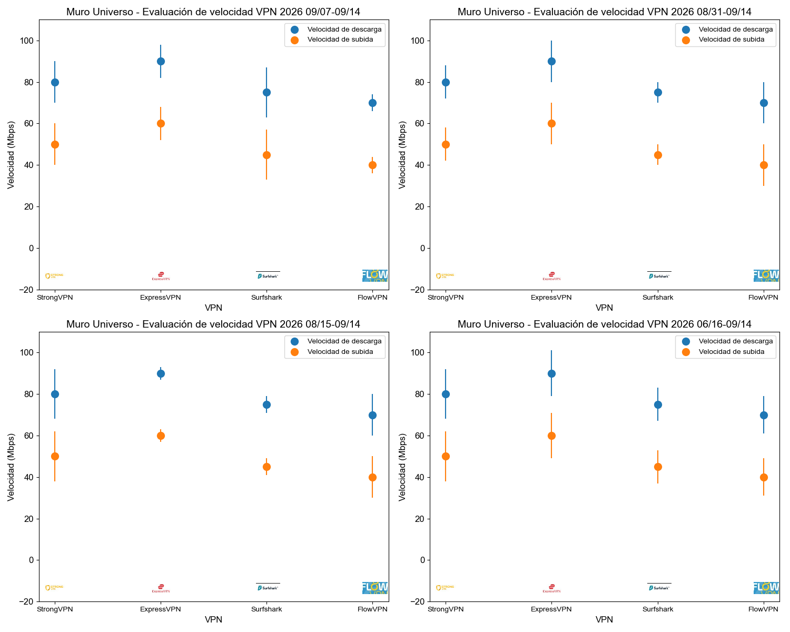

# VPN para streaming en España: cómo probar RTVE Play, Movistar Plus+, Atresplayer, Mitele y DAZN

Ver televisión española durante un viaje no depende únicamente de conectarse a Madrid. Una plataforma puede revisar la IP, las cookies, el país de la cuenta, la tienda de aplicaciones, el método de pago o la ubicación del dispositivo.

Esta guía no promete acceso permanente. Explica cómo hacer una prueba controlada durante el periodo de reembolso para saber si la VPN funciona con tu plataforma, tu cuenta y tu aparato.

> **Ruta corta:** conecta a España, confirma que la IP es española, abre una ventana privada, prueba un vídeo real durante 15 minutos y anota servidor, hora y dispositivo. Si falla, cambia una sola variable cada vez.

## Qué cambia entre las plataformas españolas

| Plataforma | Qué comprobar primero | Problema frecuente | Segundo intento útil |
|---|---|---|---|
| RTVE Play | IP española, cookies y derechos del programa | La web abre pero un directo no | Ventana privada y otro servidor en España |
| Movistar Plus+ | Cuenta, suscripción, dispositivo e IP | Login correcto, reproducción bloqueada | Revisar condiciones de viaje y cerrar sesiones antiguas |
| Atresplayer | IP, cuenta y caché de la app | Catálogo o directo diferente | Navegador antes que app, luego reinstalar caché |
| Mitele | IP, cookies y derechos territoriales | Error regional en un contenido concreto | Probar otro programa para separar derechos de bloqueo VPN |
| DAZN España | Cuenta, región, IP y dispositivo | Evento no disponible o error de ubicación | Revisar país de suscripción y términos del servicio |

Dentro de la Unión Europea puede existir portabilidad temporal para determinadas suscripciones de pago. Antes de usar una VPN, comprueba si tu cuenta ya ofrece acceso durante el viaje.

## Orden de prueba de las VPN

| Orden | VPN | Para quién tiene sentido | Qué debes validar |
|---:|---|---|---|
| 1 | [StrongVPN](https://strongvpn.com/es/?tr_aid=60d96b5810e50&chan=w_github_es&data1=es-home&data2=hero) | Quien busca una opción pagada de coste más contenido para un año | Servidor español, plataforma principal, precio final y reembolso |
| 2 | [ExpressVPN](https://go.expressvpn.com/c/3828265/1509296/16063) | Quien prioriza una app pulida y soporte sobre el precio | Plataforma exacta, dispositivo de TV, total y renovación |
| 3 | [Surfshark](https://get.surfshark.net/aff_c?offer_id=323&aff_id=5585&source=w_github&aff_sub=streaming) | Familias o casas con muchos dispositivos | Compromiso largo, impuestos, apps de TV y conexiones simultáneas |
| 4 | [FlowVPN](https://www.flowvpx.com/sign-up/?locale=es&special=FREETRIAL&r=35-890485.w_github) | Quien quiere una prueba corta antes de pagar un plan largo | Fin de prueba, cancelación, servidor de España y estabilidad |

Divulgación: los enlaces pueden generar una comisión para VPN Mundo sin coste adicional para el lector. Por eso indicamos límites, precio total y pruebas concretas en vez de garantizar que una plataforma funcionará siempre.

## Prueba de 20 minutos

1. Sin VPN, anota velocidad, país de IP y mensaje de error.
2. Conecta a una ubicación española.
3. Confirma IP y DNS antes de abrir la plataforma.
4. Usa una ventana privada para evitar cookies de la región anterior.
5. Inicia sesión y reproduce contenido, no solo la portada.
6. Prueba directo y bajo demanda por separado.
7. Mantén la reproducción 15-20 minutos y cambia de calidad.
8. Guarda servidor, protocolo, hora, aparato y resultado.

## El dispositivo puede ser el verdadero bloqueo

### Windows y Mac

Empieza por navegador porque permite limpiar cookies y comparar rápidamente servidores. Desactiva temporalmente extensiones de ubicación o bloqueo solo para diagnosticar, no como configuración permanente.

### iPhone y Android

Comprueba permisos de ubicación, país de App Store/Google Play y si la app conserva datos regionales. Cambiar el país de la tienda puede afectar saldo y suscripciones; revisa antes las condiciones oficiales.

### Fire TV, Android TV y Apple TV

Primero demuestra que la misma cuenta funciona en un portátil. Después revisa si la aplicación VPN y la plataforma están disponibles en la tienda española. Si el televisor no admite VPN, una instalación en router añade complejidad y debe probarse antes de conservar el plan.

## Cómo leer nuestras pruebas de velocidad

Una gráfica rápida no demuestra por sí sola que Movistar Plus+ o DAZN funcionen. Sirve para descartar conexiones inestables y comparar tendencia. El bloqueo de una plataforma puede cambiar aunque la velocidad permanezca igual.

[Consulta la comparativa completa y el precio en moneda local](../#prueba-diaria-de-velocidad-vpn).

## Diagnóstico por mensaje

### La web abre, pero el vídeo no

Prueba otro contenido. Si uno funciona y otro no, puede ser un problema de derechos, no de la VPN. Si ninguno funciona, cambia servidor y limpia la sesión en una ventana privada.

### La app muestra un país incorrecto

Revisa tienda de aplicaciones, GPS, caché y cuenta. No cambies todos los ajustes a la vez; así sabrás qué solucionó el problema.

### El directo se corta durante el partido

Prioriza estabilidad sobre pico de velocidad: servidor menos congestionado, cable Ethernet, protocolo alternativo y calidad 1080p antes de 4K.

### Funciona en el portátil, pero no en la TV

La ruta VPN ya está validada. El problema suele estar en app, DNS, tienda regional, router o cuenta del televisor.

## Decisión final

Para una compra de hasta un año y una primera prueba con coste contenido, empieza por StrongVPN. Elige ExpressVPN si aceptas pagar más por experiencia de aplicación y soporte; Surfshark si necesitas muchos dispositivos; FlowVPN si tu prioridad es una comprobación corta. Conserva únicamente la VPN que haya superado tu plataforma real antes de terminar el reembolso.

[Volver a la comparativa de VPN Mundo](../)
